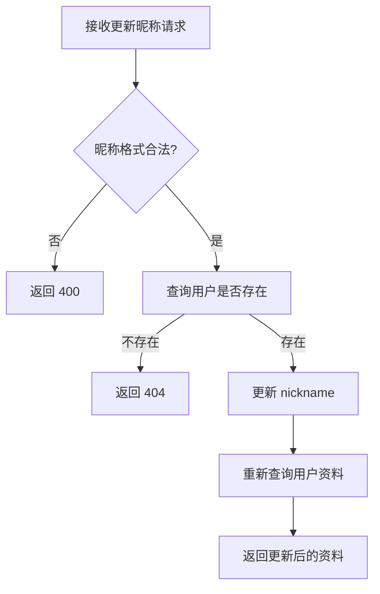

# 为用户资料新增昵称更新能力

> 生成时间: 2026-04-27
> 需求来源: 为用户资料页增加昵称更新能力，要求保留现有资料读取逻辑，只增加更新入口与单元测试

## 1. 背景与目标

**需求背景**:
当前用户资料接口只支持读取，不支持更新昵称，前端需要一个稳定的更新入口。

**预期结果**:
用户可以提交新的昵称，服务端完成校验、持久化和返回更新后的资料结构。

## 2. 范围 / 非范围

**In Scope**:
- 新增昵称更新 API
- 复用现有用户查询逻辑
- 增加参数校验与单元测试

**Out of Scope**:
- 不修改头像、邮箱等其他资料字段
- 不调整登录鉴权逻辑
- 不改造资料页 UI 布局

## 3. 现状与代码证据

| 文件路径 | 关键符号 | 行号范围 | 当前行为摘要 |
|----------|----------|----------|-------------|
| `src/modules/user/user.controller.ts` | `getProfile` | L12-L28 | 提供用户资料读取接口 |
| `src/modules/user/user.service.ts` | `getUserProfile` | L10-L42 | 聚合用户资料查询逻辑 |
| `src/modules/user/user.repository.ts` | `findById` | L5-L18 | 根据用户 ID 查询用户记录 |

**当前测试框架与测试组织**:
- 测试框架: Vitest（来自 `package.json` 与 `vitest.config.ts`）
- 测试目录/命名约定: `src/**/*.test.ts`

**当前组件复用入口**:
- 项目内已有组件目录: 本需求不涉及前端组件
- 组件化工具集中存放位置: 本需求不涉及
- 可复用基础组件/业务组件: 本需求不涉及

**现有模式总结**:
当前用户模块采用 `controller -> service -> repository` 分层，参数校验放在 controller 层，数据库写入走 repository。

## 4. 方案设计

### 4.1 模块拆分

| 模块 | 职责 | 输入 | 输出 | 依赖 |
|------|------|------|------|------|
| `user.controller` | 接收更新请求并做参数校验 | HTTP 请求 | 标准响应 | `user.service` |
| `user.service` | 执行业务规则与更新流程 | `userId`, `nickname` | 更新后的用户资料 | `user.repository` |
| `user.repository` | 执行持久化更新 | `userId`, `nickname` | 数据库更新结果 | DB client |

### 4.2 核心流程



### 4.3 API 定义

#### `PATCH /api/users/profile/nickname`

**描述**: 更新当前登录用户的昵称。

**请求参数**:

| 参数 | 位置 | 类型 | 必填 | 说明 |
|------|------|------|------|------|
| nickname | body | string | 是 | 新昵称，长度 2-20 |

**返回**:

| 字段 | 类型 | 说明 |
|------|------|------|
| id | string | 用户 ID |
| nickname | string | 更新后的昵称 |
| updatedAt | string | 更新时间 |

**错误码**: 400 参数错误 / 404 用户不存在 / 409 昵称冲突 / 500 内部错误

#### `updateNickname(userId: string, nickname: string): Promise<UserProfile>`

| 参数 | 类型 | 必填 | 说明 |
|------|------|------|------|
| userId | string | 是 | 当前用户 ID |
| nickname | string | 是 | 新昵称 |

**返回**: `Promise<UserProfile>` — 更新后的用户资料

### 4.4 数据结构

```typescript
interface UpdateNicknameRequest {
  nickname: string
}

interface UserProfile {
  id: string
  nickname: string
  updatedAt: string
}
```

### 4.5 数据库设计（按需出现）

#### 表结构变更

##### `users`

| 字段 | 类型 | 约束 | 说明 |
|------|------|------|------|
| nickname | VARCHAR(20) | NOT NULL | 用户昵称 |
| updated_at | TIMESTAMP | NOT NULL | 更新时间 |

#### 索引设计

| 表 | 索引名 | 字段 | 类型 | 用途 |
|----|--------|------|------|------|
| users | uk_users_nickname | nickname | UNIQUE | 保证昵称唯一 |

#### 迁移说明

- 新增表: 无
- 变更表: `users.nickname` 增加唯一约束（若当前未配置）
- 数据迁移: 对历史空昵称数据做一次默认值填充或迁移脚本兜底

### 4.6 前端组件设计（按需出现）

本需求不涉及新增前端组件。

### 4.7 影响面（按需出现）

- UI 变更: 无
- 存储变更: `users` 表可能增加唯一索引
- 配置变更: 无

## 5. 影响面与兼容性

- **对现有模块影响**: 仅影响 `user` 模块的写路径，不影响现有读取接口契约
- **兼容性处理**: 保持 `getProfile` 返回结构不变
- **迁移/发布注意事项**: 若增加昵称唯一索引，需先处理历史脏数据

## 6. 风险与回滚

| 风险 | 概率 | 影响 | 缓解措施 |
|------|------|------|----------|
| 历史数据不满足唯一约束 | 中 | 迁移失败 | 上线前扫描重复昵称并修正 |
| 前端传入非法昵称 | 高 | 请求失败 | 在 controller 层增加长度与字符校验 |

**回滚方式**: 回滚写接口发布版本；若已加索引，按迁移脚本回退索引变更。

## 7. 单元测试设计

### 7.1 测试策略

- **测试框架**: Vitest，沿用项目现有断言与 mock 方式
- **Mock 策略**: mock `user.repository`，不 mock 纯业务函数

### 7.2 测试用例

#### `updateNickname` 测试

| 用例 | 输入 | 预期输出 | 类型 |
|------|------|----------|------|
| 正常路径 - 更新成功 | `userId=1`, `nickname='tommy'` | 返回更新后的 `UserProfile` | happy path |
| 边界 - 最短昵称 | `nickname='ab'` | 更新成功 | boundary |
| 边界 - 最长昵称 | `nickname='abcdefghijklmnopqrst'` | 更新成功 | boundary |
| 异常 - 用户不存在 | `userId=404` | 抛出 not found 错误 | error |
| 异常 - 昵称冲突 | `nickname='used-name'` | 抛出 conflict 错误 | error |

### 7.3 测试文件规划

| 测试文件 | 覆盖目标 |
|----------|----------|
| `src/modules/user/user.service.test.ts` | `updateNickname` 业务逻辑 |
| `src/modules/user/user.controller.test.ts` | 请求参数校验与响应码 |

## 8. 实施计划

| 步骤 | 内容 | 涉及文件 |
|------|------|----------|
| 1 | 在 controller 新增昵称更新入口并复用现有鉴权上下文 | `src/modules/user/user.controller.ts` |
| 2 | 在 service 增加 `updateNickname` 逻辑 | `src/modules/user/user.service.ts` |
| 3 | 在 repository 增加昵称更新方法 | `src/modules/user/user.repository.ts` |
| 4 | 按当前项目测试框架补单元测试 | `src/modules/user/*.test.ts` |
| 5 | 运行现有测试命令验证 | `package.json` |

## 9. 验收标准

| # | 验收项 | 验证方式 |
|---|--------|----------|
| 1 | 能成功更新昵称 | 调用 `PATCH /api/users/profile/nickname` 验证响应 |
| 2 | 非法昵称被拒绝 | 构造非法参数并验证 400 |
| 3 | 不存在用户返回 404 | mock 用户不存在场景 |
| 4 | 单元测试全部通过 | 运行项目现有 Vitest 命令 |

## 10. 未决问题

| # | 问题 | 影响范围 | 需要谁确认 |
|---|------|----------|-----------|
| 1 | 昵称是否需要全局唯一 | 决定是否增加唯一索引 | 产品 / 后端负责人 |
| 2 | 昵称允许的字符集范围 | 影响校验规则 | 产品 / 前端负责人 |
