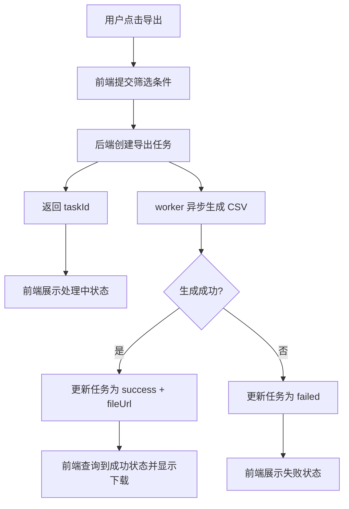
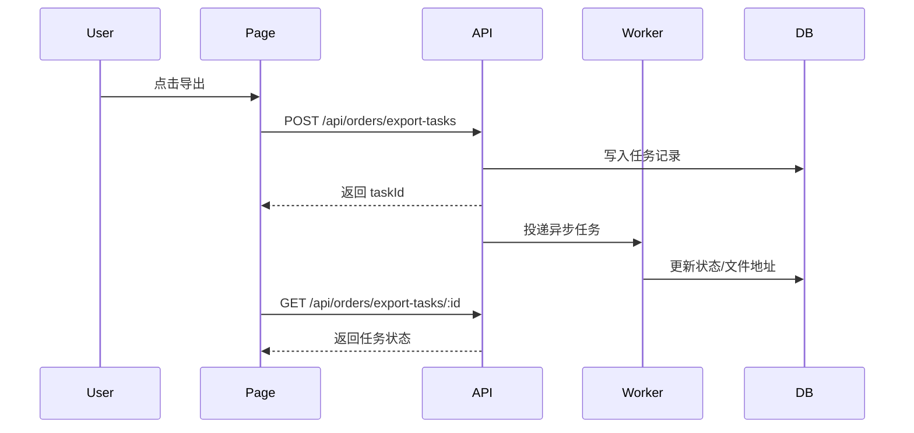
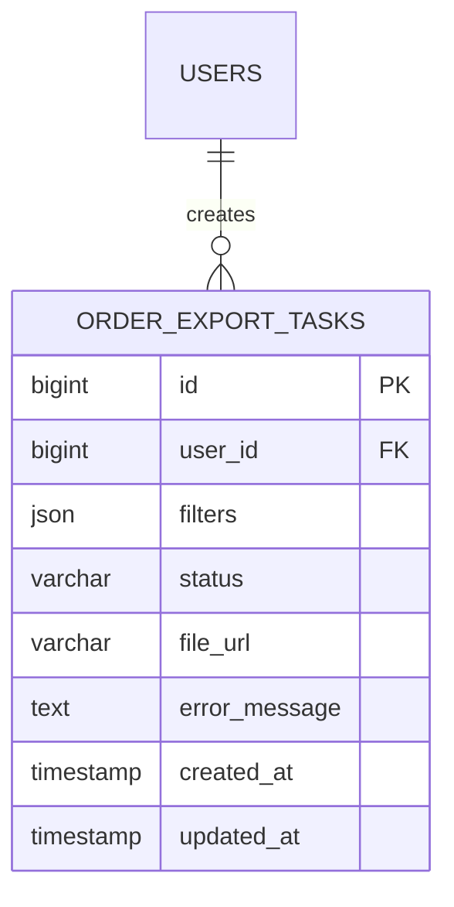

# 为订单页新增批量导出能力

> 生成时间: 2026-04-27
> 需求来源: 在订单列表页增加批量导出按钮，支持筛选条件透传、后端异步生成导出任务，并在页面展示导出状态

## 1. 背景与目标

**需求背景**:
订单列表已有筛选与分页，但缺少批量导出能力，运营需要在保留当前筛选条件下导出 CSV。

**预期结果**:
用户在订单列表页点击导出后，系统创建导出任务，后端异步生成文件，前端展示任务状态与下载入口。

## 2. 范围 / 非范围

**In Scope**:
- 前端订单页增加导出入口与任务状态区域
- 后端新增导出任务创建、查询接口
- 新增导出任务表与异步处理流程
- 基于项目现有测试框架补充单元测试

**Out of Scope**:
- 不改造现有订单筛选逻辑
- 不新增复杂权限体系
- 不支持 Excel，只支持 CSV

## 3. 现状与代码证据

| 文件路径 | 关键符号 | 行号范围 | 当前行为摘要 |
|----------|----------|----------|-------------|
| `src/pages/orders/index.tsx` | `OrdersPage` | L15-L120 | 渲染订单列表、筛选栏和分页 |
| `src/components/order/OrderTable.tsx` | `OrderTable` | L10-L85 | 展示表格数据 |
| `src/api/order.ts` | `fetchOrders` | L5-L28 | 获取订单列表 |
| `server/modules/order/order.controller.ts` | `listOrders` | L12-L36 | 提供订单列表接口 |
| `server/modules/order/order.service.ts` | `listOrders` | L20-L64 | 组装查询条件并返回分页数据 |

**当前测试框架与测试组织**:
- 前端测试框架: Vitest + Testing Library（来自 `package.json`）
- 后端测试框架: Vitest（沿用 monorepo 统一配置）
- 测试目录/命名约定: `src/**/*.test.tsx`, `server/**/*.test.ts`

**当前组件复用入口**:
- 项目内已有组件目录: `src/components/common`, `src/components/order`
- 组件化工具集中存放位置: `src/components/ui`
- 可复用基础组件/业务组件: `Button`, `Modal`, `TableToolbar`, `StatusBadge`

**现有模式总结**:
前端按 `page -> business component -> ui component` 组织，后端按 `controller -> service -> repository` 分层。异步任务已有统一 job runner 可复用。

## 4. 方案设计

### 4.1 模块拆分

| 模块 | 职责 | 输入 | 输出 | 依赖 |
|------|------|------|------|------|
| `OrdersPage` | 组合页面状态与导出交互 | 筛选条件、用户操作 | 页面展示 | `OrderToolbar`, `OrderExportPanel` |
| `OrderToolbar` | 展示筛选区与导出入口 | 当前筛选条件 | 导出触发事件 | `Button`, `TableToolbar` |
| `OrderExportPanel` | 展示导出任务状态与下载入口 | 导出任务列表 | 状态区 UI | `StatusBadge` |
| `orderExportApi` | 前端导出接口封装 | 筛选条件、任务 ID | HTTP 响应 | 后端 API |
| `orderExportService` | 创建导出任务与调度 job | 用户 ID、筛选条件 | 任务记录 | `orderExportRepository`, `jobRunner` |
| `orderExportWorker` | 异步生成 CSV | 任务 ID | 文件地址 | storage client |

### 4.2 核心流程





### 4.3 API 定义

#### `POST /api/orders/export-tasks`

**描述**: 根据当前订单筛选条件创建导出任务。

**请求参数**:

| 参数 | 位置 | 类型 | 必填 | 说明 |
|------|------|------|------|------|
| filters | body | object | 是 | 当前订单筛选条件 |
| sort | body | object | 否 | 当前排序规则 |

**返回**:

| 字段 | 类型 | 说明 |
|------|------|------|
| taskId | string | 导出任务 ID |
| status | string | 初始状态，固定为 `pending` |

**错误码**: 400 参数错误 / 403 无权限 / 500 内部错误

#### `GET /api/orders/export-tasks/:taskId`

**描述**: 查询单个导出任务状态。

**请求参数**:

| 参数 | 位置 | 类型 | 必填 | 说明 |
|------|------|------|------|------|
| taskId | path | string | 是 | 导出任务 ID |

**返回**:

| 字段 | 类型 | 说明 |
|------|------|------|
| taskId | string | 导出任务 ID |
| status | string | `pending | running | success | failed` |
| fileUrl | string | 成功时返回下载地址 |
| errorMessage | string | 失败时返回错误信息 |

**错误码**: 404 任务不存在 / 500 内部错误

#### `createExportTask(userId: string, filters: OrderFilters): Promise<ExportTask>`

| 参数 | 类型 | 必填 | 说明 |
|------|------|------|------|
| userId | string | 是 | 发起人 |
| filters | OrderFilters | 是 | 当前筛选条件 |

**返回**: `Promise<ExportTask>` — 新建的导出任务

### 4.4 数据结构

```typescript
interface ExportTask {
  taskId: string
  userId: string
  filters: OrderFilters
  status: 'pending' | 'running' | 'success' | 'failed'
  fileUrl?: string
  errorMessage?: string
}

interface OrderExportPanelProps {
  taskId?: string
  onRefresh: () => void
}
```

### 4.5 数据库设计（按需出现）

#### ER 关系图



#### 表结构定义

##### `order_export_tasks`

| 字段 | 类型 | 约束 | 说明 |
|------|------|------|------|
| id | BIGINT | PK, AUTO_INCREMENT | 主键 |
| user_id | BIGINT | NOT NULL | 发起导出的用户 |
| filters | JSON | NOT NULL | 导出时使用的筛选条件快照 |
| status | VARCHAR(20) | NOT NULL | 任务状态 |
| file_url | VARCHAR(1024) | NULL | 导出文件地址 |
| error_message | TEXT | NULL | 失败原因 |
| created_at | TIMESTAMP | NOT NULL | 创建时间 |
| updated_at | TIMESTAMP | NOT NULL | 更新时间 |

#### 索引设计

| 表 | 索引名 | 字段 | 类型 | 用途 |
|----|--------|------|------|------|
| order_export_tasks | idx_user_created_at | user_id, created_at | BTREE | 查询用户最近导出任务 |
| order_export_tasks | idx_status | status | BTREE | worker 扫描待处理任务 |

#### 迁移说明

- 新增表: `order_export_tasks`
- 变更表: 无
- 数据迁移: 无历史数据迁移，仅需上线新表

### 4.6 前端组件设计（按需出现）

#### 组件拆分

| 层级 | 组件名 | 职责 | 复用来源 | 备注 |
|------|--------|------|----------|------|
| 页面 | `OrdersPage` | 管理筛选、列表、导出任务状态 | 现有页面容器 | 只增加导出相关状态 |
| 区域 | `OrderToolbar` | 承载筛选区右侧导出按钮 | 项目内已有 `TableToolbar` 扩展 | 优先复用现有 toolbar |
| 区域 | `OrderExportPanel` | 展示任务状态与下载入口 | 新建业务组件 | 放到 `src/components/order` |
| 基础组件 | `Button` | 导出按钮 | 项目内已有 `src/components/ui/Button` | 不自研 |
| 基础组件 | `StatusBadge` | 状态展示 | 项目内已有 | 不自研 |

#### 组件复用优先级检查

1. 项目内已有组件与组件化工具集中存放位置：`src/components/ui`, `src/components/common`
2. 开源组件搜索结果：仅当现有组件不满足交互需求时评估
3. 自研实现：仅对 `OrderExportPanel` 这种项目内不存在的业务组件进行自研

#### UI 结构说明

- 页面结构: `OrdersPage = FilterToolbar + OrderTable + OrderExportPanel`
- 组件组合关系: `OrderToolbar` 触发导出，`OrderExportPanel` 订阅并展示任务状态
- 状态归属: 筛选条件与当前 taskId 在页面层；按钮 loading 与面板展示状态在组件层

### 4.7 影响面（按需出现）

- UI 变更: 订单页新增导出按钮与状态面板
- 存储变更: 新增 `order_export_tasks` 表
- 配置变更: 需要复用或配置文件存储 client

## 5. 影响面与兼容性

- **对现有模块影响**: 影响前端订单页、后端订单模块与异步任务系统
- **兼容性处理**: 原有列表接口不变，新增导出相关接口与组件
- **迁移/发布注意事项**: 先发布表结构与 worker，再开放前端入口

## 6. 风险与回滚

| 风险 | 概率 | 影响 | 缓解措施 |
|------|------|------|----------|
| 导出任务积压 | 中 | 用户长时间等待 | 复用现有 job runner 并加状态监控 |
| 过滤条件快照不完整 | 中 | 导出结果与页面不一致 | 创建任务时完整保存 filters JSON |
| 文件地址过期 | 低 | 下载失败 | 统一由后端返回可下载链接或重新签名 |

**回滚方式**: 隐藏前端导出入口；停用 worker；保留表结构但不再写入新任务。

## 7. 单元测试设计

### 7.1 测试策略

- **测试框架**: 前后端都沿用当前项目已有的 Vitest；前端 UI 测试继续使用 Testing Library
- **Mock 策略**: mock 导出 API、job runner、repository；不 mock 纯展示组件的 props 组合逻辑

### 7.2 测试用例

#### `orderExportService` 测试

| 用例 | 输入 | 预期输出 | 类型 |
|------|------|----------|------|
| 正常路径 - 创建任务成功 | 合法 `filters` | 返回 `pending` 任务记录 | happy path |
| 边界 - 空筛选条件 | `{}` | 使用默认筛选导出全部可见数据 | boundary |
| 异常 - 无权限用户 | 非法 `userId` | 抛出权限错误 | error |

#### `OrderToolbar` / `OrderExportPanel` 测试

| 用例 | 输入 | 预期输出 | 类型 |
|------|------|----------|------|
| 正常路径 - 点击导出 | 用户点击按钮 | 调用创建任务 API | happy path |
| 边界 - 任务运行中 | `status='running'` | 显示处理中状态 | boundary |
| 异常 - 任务失败 | `status='failed'` | 显示失败提示 | error |

### 7.3 测试文件规划

| 测试文件 | 覆盖目标 |
|----------|----------|
| `server/modules/order/order-export.service.test.ts` | 导出任务创建逻辑 |
| `server/modules/order/order-export.worker.test.ts` | worker 状态流转 |
| `src/components/order/OrderToolbar.test.tsx` | 导出按钮交互 |
| `src/components/order/OrderExportPanel.test.tsx` | 状态面板渲染 |

## 8. 实施计划

| 步骤 | 内容 | 涉及文件 |
|------|------|----------|
| 1 | 后端新增导出任务 controller / service / repository | `server/modules/order/*` |
| 2 | 新增导出任务表与迁移脚本 | `server/db/migrations/*` |
| 3 | 复用现有 job runner 增加导出 worker | `server/jobs/*` |
| 4 | 前端复用现有 toolbar 与基础组件，新增状态面板 | `src/pages/orders/*`, `src/components/order/*` |
| 5 | 按当前项目测试框架补齐前后端单元测试 | `server/**/*.test.ts`, `src/**/*.test.tsx` |
| 6 | 运行现有测试命令验证 | `package.json` |

## 9. 验收标准

| # | 验收项 | 验证方式 |
|---|--------|----------|
| 1 | 订单页可发起导出 | 页面点击导出按钮验证请求发送 |
| 2 | 可查询导出任务状态 | 调用任务查询接口验证状态流转 |
| 3 | 导出成功后可下载文件 | mock / 集成环境验证 `fileUrl` 展示 |
| 4 | 前端优先复用项目内现有组件 | 检查组件来源与实现位置 |
| 5 | 单元测试全部通过 | 运行项目现有测试命令 |

## 10. 未决问题

| # | 问题 | 影响范围 | 需要谁确认 |
|---|------|----------|-----------|
| 1 | 导出文件保存时长 | 影响存储成本与下载策略 | 产品 / 运维 |
| 2 | 是否需要限制每人并发导出任务数 | 影响服务负载控制 | 后端负责人 |
| 3 | 失败任务是否允许重试 | 影响 UI 交互与 worker 设计 | 产品 / 前端负责人 |
