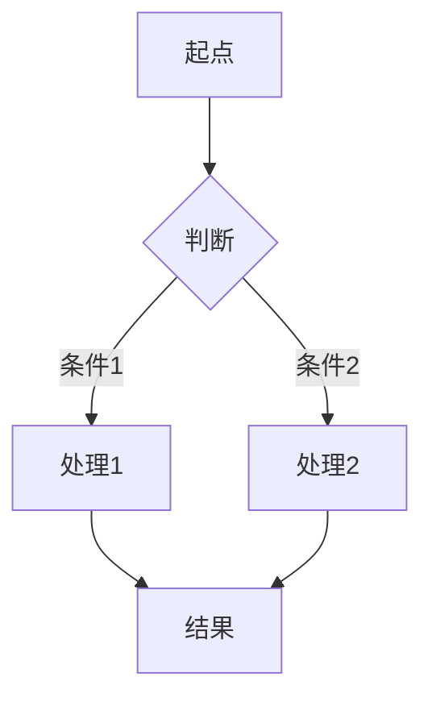
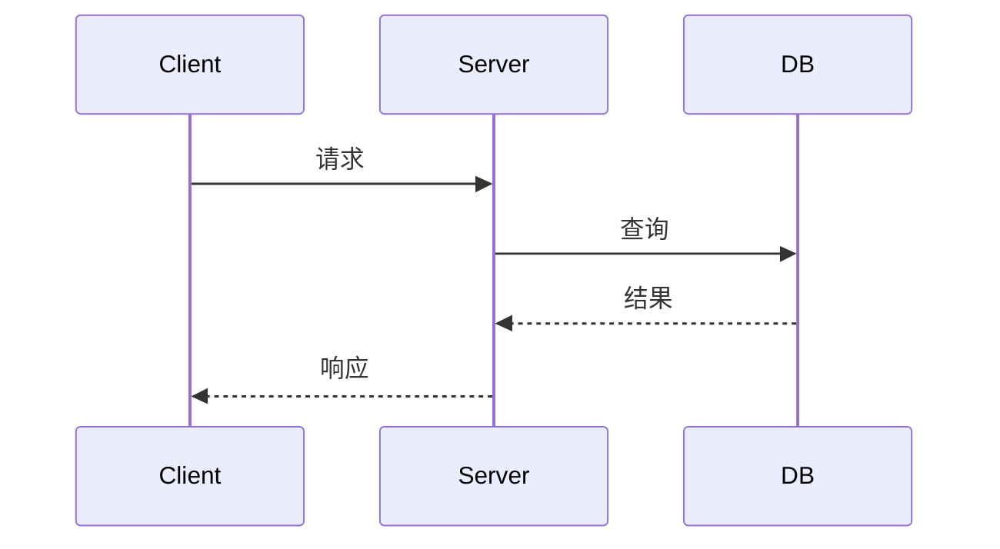
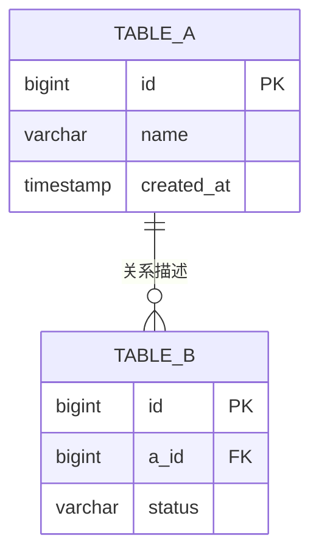

# {设计标题}

> 生成时间: {YYYY-MM-DD}
> 需求来源: {用户需求原文摘要}

## 1. 背景与目标

**需求背景**:
{为什么要做这件事，触发原因}

**预期结果**:
{做完之后系统会变成什么样}

## 2. 范围 / 非范围

**In Scope**:
- {要做的事项 1}
- {要做的事项 2}

**Out of Scope**:
- {明确不做的事项 1}
- {明确不做的事项 2}

## 3. 现状与代码证据

| 文件路径 | 关键符号 | 行号范围 | 当前行为摘要 |
|----------|----------|----------|-------------|
| `src/xxx.ts` | `functionName` | L42-L78 | {当前做了什么} |
| `src/yyy.ts` | `ClassName` | L10-L35 | {当前做了什么} |

**当前测试框架与测试组织**:
- 测试框架: {如 Jest / Vitest / pytest，必须来自当前项目}
- 测试目录/命名约定: {如 `tests/**`, `*.test.ts`}

**当前组件复用入口**:
- 项目内已有组件目录: {路径}
- 组件化工具集中存放位置: {路径}
- 可复用基础组件/业务组件: {列出关键项}

**现有模式总结**:
{当前代码的架构路径、扩展点、可复用部分}

## 4. 方案设计

### 4.1 模块拆分

| 模块 | 职责 | 输入 | 输出 | 依赖 |
|------|------|------|------|------|
| {ModuleA} | {职责} | {输入} | {输出} | {依赖} |
| {ModuleB} | {职责} | {输入} | {输出} | {依赖} |

### 4.2 核心流程



> 复杂场景补充时序图:



### 4.3 API 定义

<!-- HTTP 接口 -->

#### `METHOD /api/path`

**描述**: {一句话}

**请求参数**:

| 参数 | 位置 | 类型 | 必填 | 说明 |
|------|------|------|------|------|
| {name} | path/query/body | {type} | 是/否 | {说明} |

**返回**:

| 字段 | 类型 | 说明 |
|------|------|------|
| {name} | {type} | {说明} |

**错误码**: {列出主要错误码及含义}

<!-- 函数/方法接口 -->

#### `functionName(param: Type): ReturnType`

| 参数 | 类型 | 必填 | 说明 |
|------|------|------|------|
| {name} | {type} | 是/否 | {说明} |

**返回**: `{ReturnType}` — {说明}

### 4.4 数据结构

```typescript
// 只列类型定义，不写实现
interface ExampleEntity {
  id: string
  name: string
  status: 'active' | 'inactive'
}
```

### 4.5 数据库设计（按需出现）

#### ER 关系图



#### 表结构定义

##### `table_name`

| 字段 | 类型 | 约束 | 说明 |
|------|------|------|------|
| id | BIGINT | PK, AUTO_INCREMENT | 主键 |
| name | VARCHAR(255) | NOT NULL | {说明} |
| status | ENUM('active','inactive') | DEFAULT 'active' | {说明} |
| created_at | TIMESTAMP | DEFAULT CURRENT_TIMESTAMP | 创建时间 |
| updated_at | TIMESTAMP | ON UPDATE CURRENT_TIMESTAMP | 更新时间 |

#### 索引设计

| 表 | 索引名 | 字段 | 类型 | 用途 |
|----|--------|------|------|------|
| table_name | idx_status | status | BTREE | {查询场景} |
| table_name | uk_name | name | UNIQUE | {唯一约束场景} |

#### 迁移说明

- 新增表: {列出}
- 变更表: {列出字段变更}
- 数据迁移: {是否需要，策略}

### 4.6 前端组件设计（按需出现）

#### 组件拆分

| 层级 | 组件名 | 职责 | 复用来源 | 备注 |
|------|--------|------|----------|------|
| 页面 | {PageComponent} | {职责} | 自定义页面容器 | {备注} |
| 区域 | {SectionComponent} | {职责} | 项目内已有/开源/自研 | {备注} |
| 基础组件 | {BaseComponent} | {职责} | 项目内已有/开源/自研 | {备注} |

#### 组件复用优先级检查

1. 项目内已有组件与组件化工具集中存放位置
2. 开源组件搜索结果
3. 自研实现（仅在前两者都不满足时）

#### UI 结构说明

- 页面结构: {页面如何分区}
- 组件组合关系: {组件之间如何嵌套与通信}
- 状态归属: {哪些状态在页面层，哪些状态在组件层}

### 4.7 影响面（按需出现）

- UI 变更: {有/无，简述}
- 存储变更: {有/无，简述}
- 配置变更: {有/无，简述}

## 5. 影响面与兼容性

- **对现有模块影响**: {哪些模块受影响，怎么影响}
- **兼容性处理**: {是否需要向后兼容，如何处理}
- **迁移/发布注意事项**: {数据迁移、灰度、开关等}

## 6. 风险与回滚

| 风险 | 概率 | 影响 | 缓解措施 |
|------|------|------|----------|
| {风险描述} | 高/中/低 | {影响范围} | {怎么缓解} |

**回滚方式**: {如何回滚到变更前状态}

## 7. 单元测试设计

### 7.1 测试策略

- **测试框架**: {项目使用的测试框架}
- **Mock 策略**: {哪些依赖需要 mock，哪些走真实调用}

### 7.2 测试用例

#### {模块/函数名} 测试

| 用例 | 输入 | 预期输出 | 类型 |
|------|------|----------|------|
| 正常路径 - {场景} | {输入描述} | {预期结果} | happy path |
| 边界 - {场景} | {输入描述} | {预期结果} | boundary |
| 异常 - {场景} | {输入描述} | {预期错误/行为} | error |

### 7.3 测试文件规划

| 测试文件 | 覆盖目标 |
|----------|----------|
| `tests/xxx.test.ts` | {对应哪个源文件/模块} |

## 8. 实施计划

| 步骤 | 内容 | 涉及文件 |
|------|------|----------|
| 1 | {具体动作} | `src/xxx.ts` |
| 2 | {具体动作} | `src/yyy.ts` |
| 3 | 编写单元测试 | `tests/xxx.test.ts` |
| 4 | 运行测试并验证 | — |

## 9. 验收标准

| # | 验收项 | 验证方式 |
|---|--------|----------|
| 1 | {功能验收条件} | {怎么验证} |
| 2 | {边界场景} | {怎么验证} |
| 3 | 单元测试全部通过 | 运行测试命令 |

## 10. 未决问题

| # | 问题 | 影响范围 | 需要谁确认 |
|---|------|----------|-----------|
| 1 | {待确认的问题} | {影响什么决策} | {角色/人} |
