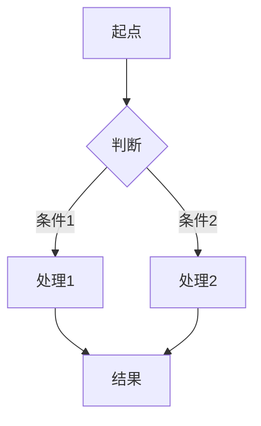
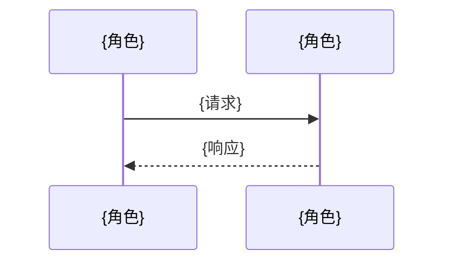
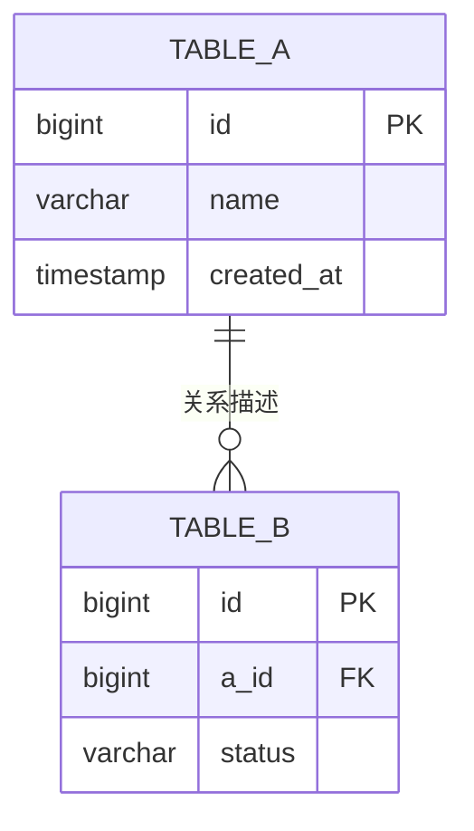

# 模块：{模块名称}

> 设计时间: {YYYY-MM-DD}
>
> 实施时间: —
>
> 所属设计: [{设计标题}](../index.md)
>
> 模块状态: ⏳ 待实现

> 头部状态应与当前实施和验收一致；影响行为、契约、测试或验收的设计变更时同步标为待迭代，纯文字修正不重置。只保留当前值，不追加状态历史。

## 1. 模块概述

**模块职责**: {这句话清晰说明该模块负责什么业务能力}

**业务边界**:

- 负责: {列表}
- 不负责: {列表}

**业务规则与行为预期**: {关键判定条件、适用边界和预期结果；影响实施的规则必须明确}

### 1.1 依赖说明

| 依赖模块                   | 依赖内容        | 引用章节    |
| -------------------------- | --------------- | ----------- |
| [{模块A}](../{a}/index.md) | `{接口/类型名}` | §3 API 定义 |

> 实施时请确保依赖模块的 API 已实现或已 mock。

（无模块间依赖则写"无"）

### 1.2 被依赖说明

| 被依赖模块                 | 本模块提供的内容 | 本模块对应章节 |
| -------------------------- | ---------------- | -------------- |
| [{模块C}](../{c}/index.md) | `{接口/类型名}`  | §3 API 定义    |

（无则写"无"）

### 1.3 外部依赖

#### {服务A}

| 依赖模块 | 依赖 API                                                                   | 不可用时策略     |
| -------- | -------------------------------------------------------------------------- | ---------------- |
| {charge} | [POST /v1/charges](../external-service/{a}/charge.md#post-v1-charges)      | {兜底/降级/mock} |
| {charge} | [GET /v1/charges/:id](../external-service/{a}/charge.md#get-v1-charges-id) | {兜底/降级/mock} |

#### {服务B}

| 依赖模块 | 依赖 API                                                      | 不可用时策略     |
| -------- | ------------------------------------------------------------- | ---------------- |
| {push}   | [POST /v1/push](../external-service/{b}/push.md#post-v1-push) | {兜底/降级/mock} |

> 外部服务放 `design-doc/external-service/{name}/`：`index.md` 服务总览 + `{module}.md` API 模块，锚点为 `{method}-{path}`。

> 外部服务文档仅记录契约；本模块的调用逻辑及 mock 测试写入本模块 §8，实施和验收写入 §9、§10。表中 mock 仅指测试替身，运行时的失败处理按本模块设计执行。

（无外部服务依赖则写"无"）

## 2. 核心流程



> 复杂场景补充时序图:



## 3. API 定义

### 3.1 HTTP 接口

#### `METHOD /api/path`

**描述**: {一句话}

**调用约束**: {输入范围和空值规则；按需说明鉴权、权限、幂等及超时行为}

**请求参数**:

| 参数   | 位置            | 类型   | 必填  | 说明   |
| ------ | --------------- | ------ | ----- | ------ |
| {name} | path/query/body | {type} | 是/否 | {说明} |

**返回**:

| 字段   | 类型   | 说明   |
| ------ | ------ | ------ |
| {name} | {type} | {说明} |

**错误码**: {列出主要错误码及含义}

### 3.2 函数/方法接口

#### `functionName(param: Type): ReturnType`

| 参数   | 类型   | 必填  | 说明   |
| ------ | ------ | ----- | ------ |
| {name} | {type} | 是/否 | {说明} |

**返回**: `{ReturnType}` — {说明}

**边界与错误行为**: {空值、极值及适用的并发、事务、重试、超时处理；对应测试写入 §8}

## 4. 数据结构

```typescript
// 本模块涉及的类型定义
interface {EntityName} {
  id: string
  {field}: {Type}
}
```

跨模块共享类型在定义方模块文档中查找，其他模块通过依赖引用获取。

## 5. 数据库设计（按需出现）

> 仅在需求涉及数据库、存储结构、表结构变更、索引、迁移时输出；否则整段省略。

### ER 关系图



### 表结构定义

#### `table_name`

| 字段       | 类型      | 约束                      | 说明     |
| ---------- | --------- | ------------------------- | -------- |
| id         | BIGINT    | PK, AUTO_INCREMENT        | 主键     |
| {field}    | {type}    | {constraint}              | {说明}   |
| created_at | TIMESTAMP | DEFAULT CURRENT_TIMESTAMP | 创建时间 |

### 索引设计

| 表         | 索引名      | 字段    | 类型  | 用途       |
| ---------- | ----------- | ------- | ----- | ---------- |
| table_name | idx\_{name} | {field} | BTREE | {查询场景} |

### 迁移说明

- 新增表: {列出}
- 变更表: {列出}
- 数据迁移: {策略}

## 6. 用户交互设计（按需出现）

> 仅在需求涉及用户交互（页面、交互、组件）时输出；否则整段省略。

### 组件拆分

| 层级     | 组件名             | 职责   | 复用来源             | 备注   |
| -------- | ------------------ | ------ | -------------------- | ------ |
| 页面     | {PageComponent}    | {职责} | 自定义页面容器       | {备注} |
| 区域     | {SectionComponent} | {职责} | 项目内已有/开源/自研 | {备注} |
| 基础组件 | {BaseComponent}    | {职责} | 项目内已有/开源/自研 | {备注} |

### 组件复用优先级检查

1. 项目内已有组件与组件工具集
2. 开源组件搜索结果
3. 自研实现（仅在前两者都不满足时）

### 界面结构说明

- 页面结构: {页面如何分区}
- 组件组合关系: {组件之间如何嵌套与通信}
- 状态归属: {哪些状态在页面层，哪些状态在组件层}

## 7. 影响面与兼容性

- **本模块影响**: {影响哪些文件/路径}
- **对依赖模块的影响**: {是否需要依赖模块配合变更}
- **兼容性处理**: {向后兼容策略}
- **迁移/发布注意事项**: {数据迁移、灰度等}
- **模块运行约束**: {模块特有的环境或版本要求；无则省略}
- **配置项与默认值**: {涉及的配置项、默认值及对行为的影响；无则省略}

## 8. 单元测试设计

### 8.1 测试策略

- **测试框架**: {项目使用的测试框架}
- **运行命令**: {模块单元测试与项目完整单元测试命令、工作目录；集成命令在 §8.4 单列}
- **Mock 策略**: {哪些依赖需要 mock，哪些走真实调用}
- **依赖模块 mock**: {需要 mock 的外部模块接口}

### 8.2 测试用例

#### {函数/组件名} 测试

| 用例编号             | 用例              | 输入       | 预期输出        | 类型       | 状态      |
| -------------------- | ----------------- | ---------- | --------------- | ---------- | --------- |
| `{module}-UT-001`    | 正常路径 - {场景} | {输入描述} | {预期结果}      | happy path | ⏳ 待实现 |
| `{module}-UT-002`    | 边界 - {场景}     | {输入描述} | {预期结果}      | boundary   | ⏳ 待实现 |
| `{module}-UT-003`    | 异常 - {场景}     | {输入描述} | {预期错误/行为} | error      | ⏳ 待实现 |

### 8.3 测试文件规划

| 测试文件               | 覆盖目标     |
| ---------------------- | ------------ |
| `tests/{name}.test.ts` | {对应源文件} |

> 测试文件路径沿用项目现有测试组织方式。项目级单元测试报告固定写入 `tests/test-report.md`，不得为本模块创建独立报告文件。

### 8.4 项目内集成验证（按需出现）

> 仅在本次涉及需验证的模块协作、调用契约或共享数据流时填写；否则省略。用例由本模块归属管理，其他模块引用。真实调用指项目内部实现，外部 API 继续 mock，除非需求明确要求联调。

- **参与模块与真实调用范围**: {哪些项目内部模块必须使用真实实现}
- **Mock 边界**: {保留替身的数据库客户端、外部服务等边界}
- **运行条件**: {前置模块、环境和工作目录}
- **测试文件与命令**: {真实文件路径及运行命令}

| 用例编号 | 场景与输入 | 预期结果 | 状态 |
| --- | --- | --- | --- |
| `{module}-IT-001` | {具体模块协作场景及输入} | {跨模块可观测结果} | ⏳ 待实现 |

> §9 与 §10 引用对应 IT 编号。集成结果在 `tests/test-report.md` 的按需附节单独记录，不计入单元测试统计。

## 9. 实施计划

| 步骤 | 可测试单元（实现 + 测试 + 运行验证） | 涉及文件 | 对应设计 | 用例编号 | 依赖 | 状态 |
| --- | --- | --- | --- | --- | --- | --- |
| 1 | {实现单元 A，立即编写对应测试并运行通过} | `{源文件}`、`{测试文件}` | §3、§4、§8 | `{module}-UT-001` | — | ⏳ 待实现 |
| 2 | {实现单元 B，立即编写对应测试并运行通过} | `{源文件}`、`{测试文件}` | §3、§8 | `{module}-UT-002`、`{module}-UT-003` | 步骤 1 | ⏳ 待实现 |
| 3 | {运行单元回归，并在 §8.4 适用时验证项目内集成点} | `{相应测试文件}` | §8、§10 | {UT 编号；适用时包含 IT 编号} | 步骤 2 | ⏳ 待实现 |

> 每步标注对应的设计章节（§3 API / §4 数据 / §5 DB / §6 组件 / §8 测试 / §10 验收），确保实施计划完整覆盖所有设计需求。
> 若某步骤依赖其他模块接口，在依赖列标注"依赖 {模块A} 步骤 N"

## 10. 验收标准

| # | 对应需求 | 设计位置 | 验收项 | 用例编号或核验方法 | 状态 |
| --- | --- | --- | --- | --- | --- |
| 1 | {原需求编号或简短要点} | {具体设计章节} | {功能验收条件} | `{module}-UT-001` | ⏳ 待实现 |
| 2 | {边界行为需求} | {具体设计章节} | {边界场景} | `{module}-UT-002` | ⏳ 待实现 |
| 3 | {本模块验证要求} | §8 | 单元测试全部通过 | {全部 UT 编号及运行命令} | ⏳ 待实现 |

> §8.4 存在时追加其集成验收项，并引用具体 IT 编号；不涉及时不添加。
>
> 当前范围内每项需求都必须在本表或 §9 找到设计与验证对应关系。无法自动测试的约束写出具体核验方法和原因，不笼统标为“不适用”；不新增独立需求追踪文档，不记录历史变更。

## 11. 未决问题

| #   | 问题           | 影响范围   | 需要谁确认 |
| --- | -------------- | ---------- | ---------- |
| 1   | {待确认的问题} | {影响范围} | {角色/人}  |

> 仅列出本模块内部未决问题，跨模块问题放入总文档 §7。
