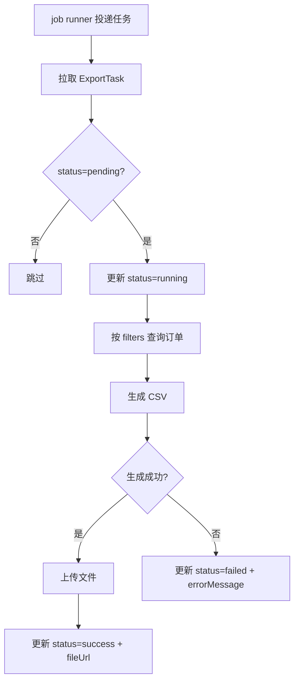

# 模块：csv

> 设计时间: 2026-05-08
>
> 实施时间: —
>
> 所属设计: [订单批量导出](../index.md)
>
> 模块状态: ⏳ 待实现

## 1. 模块概述

**模块职责**: 异步消费导出任务，根据筛选条件生成 CSV 文件并更新任务状态。

**业务边界**:

- 负责: 从 job runner 拉取任务、查询订单、生成 CSV、上传文件、更新状态
- 不负责: 任务创建与查询接口（由 task 模块负责）

### 1.1 依赖说明

| 依赖模块                 | 依赖内容                                   | 引用章节                   |
| ------------------------ | ------------------------------------------ | -------------------------- |
| [task](../task/index.md) | `ExportTask` 类型、`order_export_tasks` 表 | §4 数据结构、§5 数据库设计 |

> 实施前提：task 模块的数据结构和表已落地。

### 1.2 被依赖说明

无

## 2. 核心流程

## 3. API 定义

### 3.1 HTTP 接口

本模块无对外 HTTP 接口，仅通过 job runner 消费任务。

### 3.2 函数/方法接口

#### `processExportTask(taskId: string): Promise<void>`

| 参数   | 类型   | 必填 | 说明                |
| ------ | ------ | ---- | ------------------- |
| taskId | string | 是   | 待处理的导出任务 ID |

**副作用**: 更新 `order_export_tasks` 表状态和文件地址

#### `generateCSV(filters: OrderFilters): Promise<ReadableStream>`

| 参数    | 类型         | 必填 | 说明     |
| ------- | ------------ | ---- | -------- |
| filters | OrderFilters | 是   | 筛选条件 |

**返回**: `Promise<ReadableStream>` — CSV 文件流

## 4. 数据结构

引用 [task §4 数据结构](../task/index.md#4-数据结构)，本模块不新增独立类型。

## 7. 影响面与兼容性

- **本模块影响**: 新增 `server/jobs/order-export.worker.ts`
- **对依赖模块的影响**: 依赖 task 模块的表和类型
- **兼容性处理**: worker 独立部署，不影响现有接口
- **迁移/发布注意事项**: 先上线 task 模块再部署 worker

## 8. 单元测试设计

### 8.1 测试策略

- **测试框架**: Vitest
- **Mock 策略**: mock repository、文件存储 client
- **依赖模块 mock**: mock task 模块的 `ExportTask` 数据

### 8.2 测试用例

#### `processExportTask` 测试

| 用例                | 输入                         | 预期输出                             | 类型       | 状态      |
| ------------------- | ---------------------------- | ------------------------------------ | ---------- | --------- |
| 正常路径 - 处理成功 | `taskId='1'`, status=pending | status → running → success + fileUrl | happy path | ⏳ 待实现 |
| 边界 - 空结果集     | filters 匹配 0 条            | 生成仅含表头的 CSV                   | boundary   | ⏳ 待实现 |
| 异常 - CSV 生成失败 | 模拟文件写入错误             | status → failed + errorMessage       | error      | ⏳ 待实现 |
| 边界 - 已处理任务   | status=success               | 跳过不处理                           | boundary   | ⏳ 待实现 |

#### `generateCSV` 测试

| 用例            | 输入         | 预期输出                   | 类型       | 状态      |
| --------------- | ------------ | -------------------------- | ---------- | --------- |
| 正常路径        | 3 条订单数据 | 含表头 + 3 行数据的 CSV 流 | happy path | ⏳ 待实现 |
| 边界 - 大量数据 | 10000 条订单 | 流式输出不 OOM             | boundary   | ⏳ 待实现 |

### 8.3 测试文件规划

| 测试文件                                  | 覆盖目标                     |
| ----------------------------------------- | ---------------------------- |
| `server/jobs/order-export.worker.test.ts` | `processExportTask` 状态流转 |
| `server/jobs/order-export.csv.test.ts`    | `generateCSV` 生成逻辑       |

## 9. 实施计划

| 步骤 | 内容                      | 涉及文件                             | 依赖        | 状态      |
| ---- | ------------------------- | ------------------------------------ | ----------- | --------- |
| 1    | 实现 `generateCSV`        | `server/jobs/order-export.csv.ts`    | task 步骤 3 | ⏳ 待实现 |
| 2    | 实现 worker 主逻辑        | `server/jobs/order-export.worker.ts` | 步骤 1      | ⏳ 待实现 |
| 3    | 注册 worker 到 job runner | `server/jobs/runner.ts`              | 步骤 2      | ⏳ 待实现 |
| 4    | 编写单元测试              | `server/jobs/*.test.ts`              | 步骤 3      | ⏳ 待实现 |
| 5    | 运行测试验证              | `package.json`                       | 步骤 4      | ⏳ 待实现 |

> 依赖 task 步骤 3：确保 service 层含 ExportTask 类型和 repository

## 10. 验收标准

| #   | 验收项                       | 验证方式                   | 状态      |
| --- | ---------------------------- | -------------------------- | --------- |
| 1   | worker 成功处理 pending 任务 | mock 任务记录验证状态流转  | ⏳ 待实现 |
| 2   | CSV 格式正确                 | 验证文件内容含表头和数据行 | ⏳ 待实现 |
| 3   | 失败任务记录错误信息         | 模拟异常验证 errorMessage  | ⏳ 待实现 |
| 4   | 单元测试全部通过             | 运行 Vitest                | ⏳ 待实现 |

## 11. 未决问题

| #   | 问题                             | 影响范围 | 需要谁确认 |
| --- | -------------------------------- | -------- | ---------- |
| 1   | 大文件上传是否需要分片           | 文件存储 | 运维       |
| 2   | CSV 导出是否需要支持自定义分隔符 | 文件格式 | 产品       |
