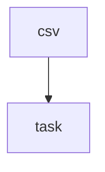

# 订单批量导出 — 总设计文档

> 最后更新: 2026-05-08
> 需求来源: 订单列表增加批量导出能力，支持筛选条件透传、后端异步生成 CSV
> 整体状态: ⏳ 待实现（由各模块状态自动派生）
> 图例: ⏳ 待实现 | 🔄 待迭代 | 🧪 待测试 | ✅ 已完成

## 1. 背景与目标

**需求背景**: 订单列表已有筛选与分页，缺少批量导出能力。

**预期结果**: 用户提交导出请求，后端异步生成 CSV 并返回下载地址。

## 2. 范围 / 非范围

**In Scope**:
- 导出任务创建与查询接口
- 导出任务表与异步 worker
- 基于现有测试框架补充单元测试

**Out of Scope**:
- 不改造现有订单筛选逻辑
- 不支持 Excel，只支持 CSV

## 3. 现状与代码证据

| 文件路径 | 关键符号 | 行号范围 | 当前行为摘要 |
|----------|----------|----------|-------------|
| `server/modules/order/order.controller.ts` | `listOrders` | L12-L36 | 订单列表接口 |
| `server/modules/order/order.service.ts` | `listOrders` | L20-L64 | 组装查询条件并返回分页 |
| `server/jobs/runner.ts` | `JobRunner.create` | L5-L22 | 异步任务投递 |

**测试框架**: Vitest
**测试目录/命名约定**: `server/**/*.test.ts`
**组件复用入口**: 不涉及前端组件

**代码规范**（从现有代码中发现，各模块实施时遵循）:
- 命名规范: 文件名 kebab-case（`order-export.service.ts`），类名 PascalCase，函数/变量 camelCase
- 代码风格: ESLint + Prettier 配置，2 空格缩进，单引号，无分号
- 错误处理: controller 层 try-catch + 统一错误中间件，service 层抛出自定义业务异常
- 日志规范: 使用 `logger.info/error` 记录关键路径（任务创建、状态变更、异常），含 userId 和 taskId
- 注释规范: 公开函数使用 JSDoc，复杂业务逻辑加行内注释

**现有模式总结**: controller → service → repository 分层，异步任务有统一 job runner。

## 4. 模块索引与依赖关系

### 4.1 模块划分

| 模块 | 职责 | 文档 | 依赖模块 |
|------|------|------|----------|
| task | 任务创建与查询接口、任务表设计与迁移 | [task](./task/index.md) | — |
| csv | 异步生成 CSV、更新任务状态 | [csv](./csv/index.md) | task |

### 4.2 模块依赖图



> csv 依赖 task 模块定义的 `ExportTask` 类型和任务表

### 4.3 循环依赖检查

> 结果: ✅ 无循环依赖

- 依赖图为单向：csv → task
- 拓扑序：先实施 task，再实施 csv

## 5. 跨模块方案设计

### 5.1 跨模块共享数据结构

```typescript
// 两个模块共用，定义在 task，csv 通过模块引用获取
interface ExportTask {
  taskId: string
  userId: string
  filters: OrderFilters
  status: 'pending' | 'running' | 'success' | 'failed'
  fileUrl?: string
  errorMessage?: string
  createdAt: string
  updatedAt: string
}
```

### 5.2 跨模块共享约定

| 约定项 | 说明 | 适用模块 |
|--------|------|----------|
| 任务状态枚举 | `pending → running → success/failed` | task, csv |
| job runner | 统一使用 `server/jobs/runner.ts` 投递异步任务 | csv |

## 6. 风险与回滚

| 风险 | 概率 | 影响 | 缓解措施 |
|------|------|------|----------|
| 导出任务积压 | 中 | 用户长时间等待 | 复用 job runner 并加监控 |
| 文件地址过期 | 低 | 下载失败 | 后端返回可刷新链接 |

**回滚方式**: 停用 worker；保留表结构不再写入新任务。

## 7. 未决问题

| # | 问题 | 影响范围 | 需要谁确认 |
|---|------|----------|-----------|
| 1 | 导出文件保存时长 | 存储成本与下载策略 | 产品 / 运维 |
| 2 | 是否需要限制每人并发导出数 | 服务负载控制 | 后端负责人 |
