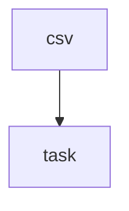

# 订单批量导出 — 总设计文档

> 设计时间: 2026-05-08
>
> 需求来源: 订单列表增加批量导出能力，支持筛选条件透传、后端异步生成 CSV

## 1. 背景与目标

**需求背景**: 订单列表已有筛选与分页，缺少批量导出能力。

**预期结果**: 用户提交导出请求，后端异步生成 CSV 并返回下载地址。

## 2. 范围 / 非范围

**In Scope**:

- 导出任务创建与查询接口
- 导出任务表与异步 worker
- 基于现有测试框架补充单元测试

**Out of Scope**:

- 不改造现有订单筛选逻辑
- 不支持 Excel，只支持 CSV

## 3. 代码规范

各模块实施时遵循:

- 命名规范: 文件名 kebab-case（`order-export.service.ts`），类名 PascalCase，函数/变量 camelCase
- 代码风格: ESLint + Prettier 配置，2 空格缩进，单引号，无分号
- 错误处理: controller 层 try-catch + 统一错误中间件，service 层抛出自定义业务异常
- 日志规范: 使用 `logger.info/error` 记录关键路径（任务创建、状态变更、异常），含 userId 和 taskId
- 注释规范: 公开函数使用 JSDoc，复杂业务逻辑加行内注释

## 4. 模块索引与依赖关系

### 4.1 模块划分

| 模块 | 职责                                 | 文档                    | 依赖模块 | 状态      |
| ---- | ------------------------------------ | ----------------------- | -------- | --------- |
| task | 任务创建与查询接口、任务表设计与迁移 | [task](./task/index.md) | —        | ⏳ 待实现 |
| csv  | 异步生成 CSV、更新任务状态           | [csv](./csv/index.md)   | task     | ⏳ 待实现 |

### 4.2 模块依赖图

> csv 依赖 task 模块定义的 `ExportTask` 类型和任务表

### 4.3 循环依赖检查

> 结果: ✅ 无循环依赖

- 依赖图为单向：csv → task
- 拓扑序：先实施 task，再实施 csv

## 5. 风险与回滚

| 风险         | 概率 | 影响           | 缓解措施                 |
| ------------ | ---- | -------------- | ------------------------ |
| 导出任务积压 | 中   | 用户长时间等待 | 复用 job runner 并加监控 |
| 文件地址过期 | 低   | 下载失败       | 后端返回可刷新链接       |

**回滚方式**: 停用 worker；保留表结构不再写入新任务。

## 6. 跨模块未决问题

| #   | 问题                       | 影响范围           | 需要谁确认  |
| --- | -------------------------- | ------------------ | ----------- |
| 1   | 导出文件保存时长           | 存储成本与下载策略 | 产品 / 运维 |
| 2   | 是否需要限制每人并发导出数 | 服务负载控制       | 后端负责人  |
