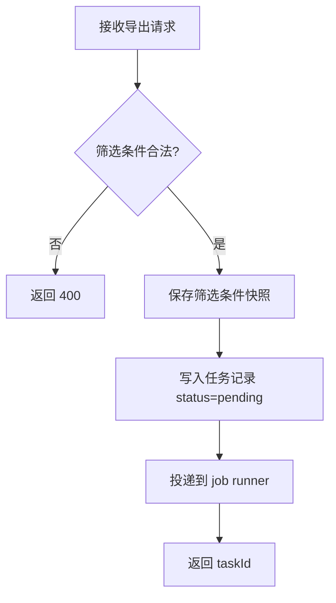

# 模块：task

> 最后更新: 2026-05-08
> 所属设计: [订单批量导出](../index.md)
> 模块状态: ⏳ 待实现

## 1. 模块概述

**模块职责**: 提供导出任务的创建和查询接口，定义数据结构与表设计。

**业务边界**:
- 负责: 任务创建/查询 API、任务表与迁移、参数校验
- 不负责: CSV 文件生成（由 csv 模块负责）

### 1.1 依赖说明

无模块间依赖（本模块为被依赖方）。

### 1.2 被依赖说明

| 被依赖模块 | 本模块提供的内容 | 本模块对应章节 |
|------------|-----------------|---------------|
| [csv](../csv/index.md) | `ExportTask` 类型、任务表 | §4 数据结构、§5 数据库设计 |

## 2. 核心流程



## 3. API 定义

### 3.1 HTTP 接口

#### `POST /api/orders/export-tasks`

**描述**: 根据筛选条件创建导出任务。

**请求参数**:

| 参数 | 位置 | 类型 | 必填 | 说明 |
|------|------|------|------|------|
| filters | body | object | 是 | 当前订单筛选条件 |

**返回**:

| 字段 | 类型 | 说明 |
|------|------|------|
| taskId | string | 导出任务 ID |
| status | string | 固定为 `pending` |

**错误码**: 400 参数错误 / 500 内部错误

#### `GET /api/orders/export-tasks/:taskId`

**描述**: 查询单个导出任务状态与结果。

**返回**:

| 字段 | 类型 | 说明 |
|------|------|------|
| taskId | string | 任务 ID |
| status | string | `pending` / `running` / `success` / `failed` |
| fileUrl | string | 成功时返回下载地址 |
| errorMessage | string | 失败时返回错误信息 |

**错误码**: 404 任务不存在 / 500 内部错误

### 3.2 函数/方法接口

#### `createExportTask(userId: string, filters: OrderFilters): Promise<ExportTask>`

| 参数 | 类型 | 必填 | 说明 |
|------|------|------|------|
| userId | string | 是 | 发起人 |
| filters | OrderFilters | 是 | 筛选条件 |

**返回**: `Promise<ExportTask>` — 新建的导出任务

#### `getExportTask(taskId: string): Promise<ExportTask>`

| 参数 | 类型 | 必填 | 说明 |
|------|------|------|------|
| taskId | string | 是 | 任务 ID |

**返回**: `Promise<ExportTask>` — 任务记录

## 4. 数据结构

```typescript
interface ExportTask {
  taskId: string
  userId: string
  filters: OrderFilters
  status: 'pending' | 'running' | 'success' | 'failed'
  fileUrl?: string
  errorMessage?: string
  createdAt: string
  updatedAt: string
}
```

## 5. 数据库设计

### 表结构定义

#### `order_export_tasks`

| 字段 | 类型 | 约束 | 说明 |
|------|------|------|------|
| id | BIGINT | PK, AUTO_INCREMENT | 主键 |
| user_id | BIGINT | NOT NULL | 发起用户 |
| filters | JSON | NOT NULL | 筛选条件快照 |
| status | VARCHAR(20) | NOT NULL, DEFAULT 'pending' | 任务状态 |
| file_url | VARCHAR(1024) | NULL | 导出文件地址 |
| error_message | TEXT | NULL | 失败原因 |
| created_at | TIMESTAMP | NOT NULL | 创建时间 |
| updated_at | TIMESTAMP | NOT NULL | 更新时间 |

### 索引设计

| 表 | 索引名 | 字段 | 类型 | 用途 |
|----|--------|------|------|------|
| order_export_tasks | idx_user_created_at | user_id, created_at | BTREE | 用户最近任务查询 |
| order_export_tasks | idx_status | status | BTREE | worker 扫描待处理 |

### 迁移说明

- 新增表: `order_export_tasks`
- 变更表: 无
- 数据迁移: 无历史数据

## 7. 影响面与兼容性

- **本模块影响**: `server/modules/order/` 新增导出相关文件
- **对依赖模块的影响**: 为 csv 模块提供数据结构和表访问
- **兼容性处理**: 原有订单列表接口不变
- **迁移/发布注意事项**: 先发布表结构与 API，再部署 csv 模块

## 8. 单元测试设计

### 8.1 测试策略

- **测试框架**: Vitest
- **Mock 策略**: mock repository、job runner
- **依赖模块 mock**: 无

### 8.2 测试用例

#### `createExportTask` 测试

| 用例 | 输入 | 预期输出 | 类型 | 状态 |
|------|------|----------|------|------|
| 正常路径 - 创建成功 | 合法 `filters` | 返回 `pending` 任务 | happy path | ⏳ |
| 边界 - 空筛选条件 | `{}` | 导出全部数据 | boundary | ⏳ |
| 异常 - 无效 filters | `{invalid: true}` | 抛出参数错误 | error | ⏳ |

#### `getExportTask` 测试

| 用例 | 输入 | 预期输出 | 类型 | 状态 |
|------|------|----------|------|------|
| 正常路径 - 查询成功 | 存在的 `taskId` | 返回任务记录 | happy path | ⏳ |
| 异常 - 任务不存在 | 不存在的 `taskId` | 抛出 not found | error | ⏳ |

### 8.3 测试文件规划

| 测试文件 | 覆盖目标 |
|----------|----------|
| `server/modules/order/order-export.service.test.ts` | 任务创建/查询逻辑 |
| `server/modules/order/order-export.controller.test.ts` | 请求校验与响应 |

## 9. 实施计划

| 步骤 | 内容 | 涉及文件 | 依赖 | 状态 |
|------|------|----------|------|------|
| 1 | 新增 `order_export_tasks` 表与迁移 | `server/db/migrations/*` | — | ⏳ |
| 2 | 新增 repository | `server/modules/order/order-export.repository.ts` | 步骤 1 | ⏳ |
| 3 | 新增 service | `server/modules/order/order-export.service.ts` | 步骤 2 | ⏳ |
| 4 | 新增 controller | `server/modules/order/order-export.controller.ts` | 步骤 3 | ⏳ |
| 5 | 编写单元测试 | `server/modules/order/*.test.ts` | 步骤 4 | ⏳ |
| 6 | 运行测试验证 | `package.json` | 步骤 5 | ⏳ |

## 10. 验收标准

| # | 验收项 | 验证方式 | 状态 |
|---|--------|----------|------|
| 1 | 可创建导出任务 | 调用 `POST /api/orders/export-tasks` | ⏳ |
| 2 | 可查询任务状态 | 调用 `GET /api/orders/export-tasks/:id` | ⏳ |
| 3 | 参数校验生效 | 非法参数返回 400 | ⏳ |
| 4 | 单元测试全部通过 | 运行 Vitest | ⏳ |
