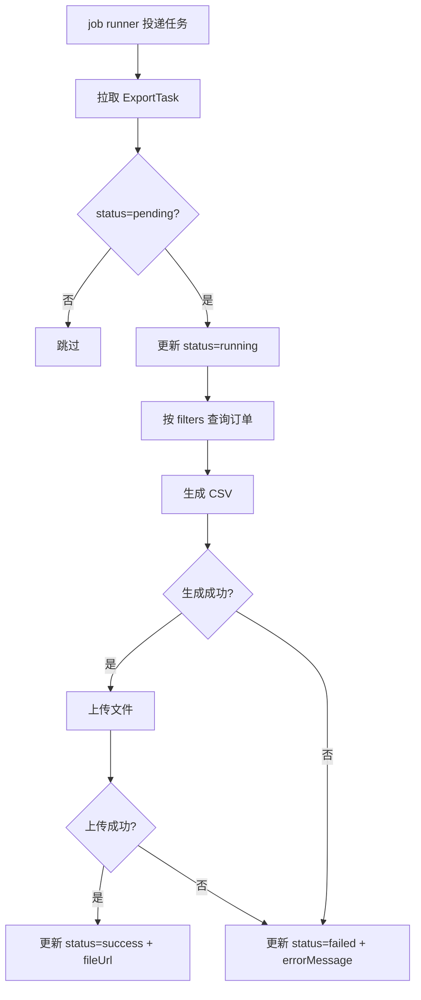

# 模块：csv

> 设计时间: 2026-05-08
>
> 实施时间: —
>
> 所属设计: [订单批量导出](../index.md)
>
> 模块状态: ⏳ 待实现

## 1. 模块概述

**模块职责**: 异步消费导出任务，根据筛选条件生成 CSV 文件并更新任务状态。

**业务边界**:

- 负责: 从 job runner 拉取任务、查询订单、生成 CSV、上传文件、更新状态
- 不负责: 任务创建与查询接口（由 task 模块负责）

### 1.1 依赖说明

| 依赖模块                 | 依赖内容                                   | 引用章节                   |
| ------------------------ | ------------------------------------------ | -------------------------- |
| [task](../task/index.md#4-数据结构) | `OrderFilters`、`ExportTask` 类型、`order_export_tasks` 表 | §4 数据结构、§5 数据库设计 |

> 实施前提：task 模块的数据结构和表已落地。

### 1.2 被依赖说明

无

### 1.3 外部依赖

#### 文件存储服务

| 依赖接口组 | 依赖 API | 测试替身 |
| --- | --- | --- |
| upload | [POST /api/v2/upload](../external-service/storage/upload.md#post-api-v2-upload) | mock 返回 fileUrl 或抛出上传错误 |
| download | [POST /api/v2/sign-url](../external-service/storage/download.md#post-api-v2-sign-url) | mock 返回签名 URL |

> 外部服务自身的实现及可用性由提供方负责。本模块单元测试只验证本地调用与结果处理，mock 不作为运行时兜底；上传失败时记录任务失败状态及错误信息。

## 2. 核心流程

## 3. API 定义

### 3.1 HTTP 接口

本模块无对外 HTTP 接口，仅通过 job runner 消费任务。

### 3.2 函数/方法接口

#### `processExportTask(taskId: string): Promise<void>`

| 参数   | 类型   | 必填 | 说明                |
| ------ | ------ | ---- | ------------------- |
| taskId | string | 是   | 待处理的导出任务 ID |

**副作用**: 更新 `order_export_tasks` 表状态和文件地址

#### `generateCSV(filters: OrderFilters): Promise<ReadableStream>`

| 参数    | 类型         | 必填 | 说明     |
| ------- | ------------ | ---- | -------- |
| filters | OrderFilters | 是   | 筛选条件 |

**返回**: `Promise<ReadableStream>` — CSV 文件流

## 4. 数据结构

引用 [task §4 数据结构](../task/index.md#4-数据结构) 中的 `OrderFilters` 和 `ExportTask`，本模块不重复定义。`ReadableStream` 使用示例运行环境提供的 Web Streams 类型。

## 7. 影响面与兼容性

- **本模块影响**: 新增 `server/jobs/order-export.worker.ts`
- **对依赖模块的影响**: 依赖 task 模块的表和类型
- **兼容性处理**: worker 独立部署，不影响现有接口
- **迁移/发布注意事项**: 先上线 task 模块再部署 worker

## 8. 单元测试设计

### 8.1 测试策略

- **测试框架**: Vitest
- **工作目录**: 消费项目根目录
- **模块运行命令**: `npx --no-install vitest run server/jobs/order-export.worker.test.ts server/jobs/order-export.csv.test.ts server/jobs/runner.test.ts`
- **项目完整单元测试命令**: `npx --no-install vitest run --exclude '**/*.integration.test.ts'`
- **Mock 策略**: mock repository、文件存储 client
- **依赖模块 mock**: mock task 模块的 `ExportTask` 数据

### 8.2 测试用例

#### `processExportTask` 测试

| 用例编号     | 用例                | 输入                         | 预期输出                             | 类型       | 状态      |
| ------------ | ------------------- | ---------------------------- | ------------------------------------ | ---------- | --------- |
| `csv-UT-001` | 正常路径 - 处理成功 | `taskId='1'`、status=pending；mock 存储 client 返回 fileUrl | 正确向 client 传入本地生成的 CSV、文件名及大小；将返回 fileUrl 保存到任务，状态变为 success | happy path | ⏳ 待实现 |
| `csv-UT-002` | 边界 - 空结果集     | filters 匹配 0 条            | 生成仅含表头的 CSV                   | boundary   | ⏳ 待实现 |
| `csv-UT-003` | 异常 - CSV 生成失败 | 模拟文件写入错误             | status → failed + errorMessage       | error      | ⏳ 待实现 |
| `csv-UT-004` | 边界 - 已处理任务   | status=success               | 跳过不处理                           | boundary   | ⏳ 待实现 |
| `csv-UT-009` | 异常 - 外部调用失败处理 | mock 存储 client 抛出上传错误 | 本地任务变为 failed 并保存 errorMessage，不记录成功 fileUrl | error | ⏳ 待实现 |

#### `generateCSV` 测试

| 用例编号     | 用例            | 输入         | 预期输出                   | 类型       | 状态      |
| ------------ | --------------- | ------------ | -------------------------- | ---------- | --------- |
| `csv-UT-005` | 正常路径        | 3 条订单数据 | 含表头 + 3 行数据的 CSV 流 | happy path | ⏳ 待实现 |
| `csv-UT-006` | 边界 - 大量数据 | 10000 条订单 | 流式输出不 OOM             | boundary   | ⏳ 待实现 |
| `csv-UT-007` | 异常 - 读取订单失败 | mock 查询抛出数据库错误 | 流失败并传播错误，不输出成功文件 | error | ⏳ 待实现 |

#### job runner 注册测试

| 用例编号 | 用例 | 输入 | 预期输出 | 类型 | 状态 |
| --- | --- | --- | --- | --- | --- |
| `csv-UT-008` | 注册任务处理函数 | mock runner，初始化注册逻辑后投递 taskId=1 | 正确绑定导出事件，并调用 processExportTask('1') 一次 | happy path | ⏳ 待实现 |

### 8.3 测试文件规划

| 测试文件                                  | 覆盖目标                     |
| ----------------------------------------- | ---------------------------- |
| `server/jobs/order-export.worker.test.ts` | `processExportTask` 状态流转 |
| `server/jobs/order-export.csv.test.ts`    | `generateCSV` 生成逻辑       |
| `server/jobs/runner.test.ts` | 导出任务处理函数注册 |

> 项目级单元测试报告固定写入 `tests/test-report.md`，不为本模块创建独立报告。

### 8.4 项目内集成验证

- **归属与参与模块**: 用例归 csv 管理，验证 task 创建/查询服务与 csv worker、CSV 生成逻辑之间的协作。
- **真实调用范围**: `createExportTask`、task repository、`processExportTask`、`generateCSV`、`getExportTask` 使用实际实现，不 mock 这些项目内接口。
- **Mock 边界**: 数据库客户端使用同一个有状态测试替身，保存并返回本轮任务记录及预置订单；job runner 捕获任务而不启动后台进程；文件存储 client 返回受控结果。测试不连接远端 API 或生产数据库。
- **运行条件**: task 服务与 repository、csv worker 和生成器已实现；使用总文档约定的 Node.js、Vitest 环境，在消费项目根目录运行。
- **测试文件与命令**: `server/jobs/order-export.integration.test.ts`；`npx --no-install vitest run server/jobs/order-export.integration.test.ts`。

| 用例编号 | 场景与输入 | 预期结果 | 状态 |
| --- | --- | --- | --- |
| `csv-IT-001` | 使用 `{status: 'paid'}` 创建任务，向真实 worker 传入返回的 taskId，存储替身返回 fileUrl | 生成内容匹配预置订单的 CSV；通过真实查询服务取得 success 状态及相同 fileUrl | ⏳ 待实现 |
| `csv-IT-002` | 同样创建任务，但存储替身抛出上传错误 | worker 将任务写为 failed；真实查询服务返回 errorMessage，不返回成功 fileUrl | ⏳ 待实现 |

> 两条结果在 `tests/test-report.md` 的集成验证附节记录，不计入单元用例数量。需要本次 csv 实施完成时，两条集成验收均须通过。

## 9. 实施计划

| 步骤 | 可测试单元 | 涉及文件 | 对应设计 | 用例编号 | 依赖 | 状态 |
| --- | --- | --- | --- | --- | --- | --- |
| 1 | 实现 generateCSV，立即运行正常、边界与异常测试 | `server/jobs/order-export.csv.ts` 及对应测试 | §3、§8 | `csv-UT-005` 至 `007` | task 步骤 1 | ⏳ 待实现 |
| 2 | 实现 worker，立即运行状态流转和存储调用处理测试 | `server/jobs/order-export.worker.ts` 及对应测试 | §2、§3、§8 | `csv-UT-001` 至 `004`、`009` | 步骤 1 | ⏳ 待实现 |
| 3 | 注册 worker，立即运行注册测试 | `server/jobs/runner.ts` 及对应测试 | §2、§8 | `csv-UT-008` | 步骤 2 | ⏳ 待实现 |
| 4 | 运行单元回归和项目内集成验证，按验收标准核验 | §8.3、§8.4 测试文件 | §8、§10 | `csv-UT-001` 至 `009`、`csv-IT-001` 至 `002` | 步骤 3及 task 实现就绪 | ⏳ 待实现 |

> 依赖 task 步骤 1：确保 ExportTask 类型、表结构和 repository 已验证。

## 10. 验收标准

| # | 对应需求 | 设计位置 | 验收项 | 用例编号或核验方法 | 状态 |
| --- | --- | --- | --- | --- | --- |
| 1 | 异步消费导出任务 | §2、§3 processExportTask | 注册和消费正确，已处理任务不重复执行 | `csv-UT-001`、`004`、`008` | ⏳ 待实现 |
| 2 | 按筛选条件生成 CSV | §3 generateCSV | 内容、空结果和大数据流行为正确 | `csv-UT-002`、`005`、`006` | ⏳ 待实现 |
| 3 | 失败任务可查询错误 | §2、§3 | 查询、生成或上传失败按设计处理 | `csv-UT-003`、`007`、`009` | ⏳ 待实现 |
| 4 | 本模块测试要求 | §8.1–§8.3 | 本模块全部单元用例通过 | `csv-UT-001` 至 `009`，执行 §8.1 命令 | ⏳ 待实现 |
| 5 | 创建、处理、查询的跨模块协作 | §8.4 | task 与 csv 真实协作结果正确 | `csv-IT-001`、`csv-IT-002` | ⏳ 待实现 |

## 11. 未决问题

| #   | 问题                             | 影响范围 | 需要谁确认 |
| --- | -------------------------------- | -------- | ---------- |
| 1   | 大文件上传是否需要分片           | 文件存储 | 运维       |
| 2   | CSV 导出是否需要支持自定义分隔符 | 文件格式 | 产品       |
