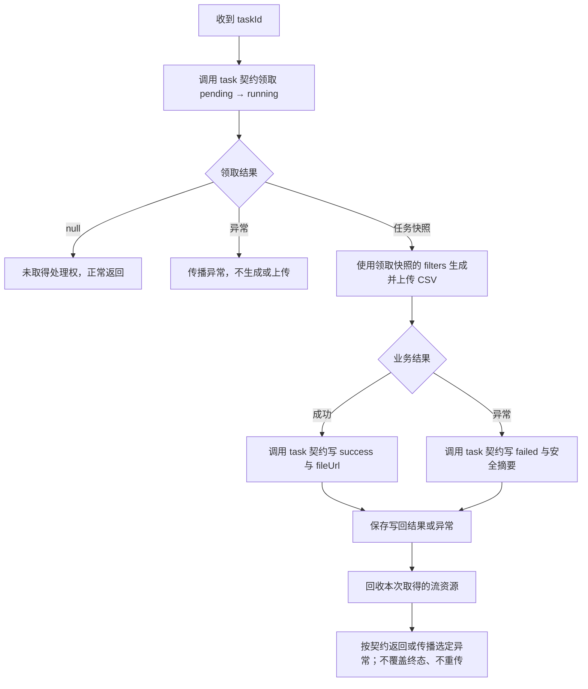

# 模块：csv

> 设计时间: 2026-05-08
>
> 实施时间: —
>
> 所属设计: [订单系统](../index.md)
>
> 模块状态: ⏳ 待实现

## 1. 模块概述

**模块职责**: 异步消费导出任务，根据筛选条件生成 CSV 文件并更新任务状态。

**业务边界**:

- 负责: 接收 job runner 投递的任务 ID、查询订单、生成 CSV、上传文件、更新状态
- 不负责: 任务创建与查询接口（由 task 模块负责）

### 1.1 依赖说明

| 依赖模块 | 依赖内容 | 引用章节 |
| --- | --- | --- |
| [task](../task/index.md#function-index) | 处理导出任务使用领取/提交服务及任务类型；生成 CSV 使用共享筛选类型 | [领取](../task/index.md#claim-task)、[提交结果](../task/index.md#submit-result)、[共用更新协议](../task/index.md#transition-contract)、[类型](../task/index.md#4-数据结构)；不直接访问 repository 或表 |

> 真实协作前提：task 的读取与条件更新服务及其 repository 已实现并自测；仅有类型或表结构不足以交验。worker 单测可按已明确的服务契约替换该依赖。

### 1.3 外部依赖

#### 文件存储服务

| 服务 | 契约 | 运行时失败处理 |
| --- | --- | --- |
| 文件存储 upload | [POST /api/v2/upload](../external-service/storage/upload.md#post-api-v2-upload) | 上传失败按 [处理导出任务](#process-export) 写回失败安全摘要；写回失败按该功能的异常优先级处理，不返回成功 `fileUrl` |

### 1.4 实现映射

| 实现位置 | 承担的职责与关键入口 | 依据或状态 |
| --- | --- | --- |
| `server/jobs/order-export.worker.ts` | 调度后的任务执行与结果更新；`processExportTask` 契约见 [处理导出任务](#process-export) | 规划 |
| `server/jobs/order-export.csv.ts` | 按订单筛选条件生成 CSV 流；`generateCSV` 契约见 [生成 CSV](#generate-csv) | 规划 |
| `server/jobs/runner.ts` | 复用既有执行器并注册导出处理函数，功能契约见 [注册处理函数](#register-handler)，集成约束见“8.4 项目内集成验证” | 既有能力，注册项待实施 |

## 2. 内部设计与共享规则

### 2.1 内部职责与状态归属

worker 负责领取、执行导出、上传、提交结果以及回收其取得的流；生成器负责读取订单并输出 CSV；runner 负责注册和调用处理函数。任务持久化及允许的状态更新归 task 所有，本模块通过功能契约请求迁移，不直接访问任务表。代码位置见“1.4 实现映射”，不额外固定普通私有辅助函数。

### 2.2 共享依赖与资源所有权

处理导出和生成 CSV 使用 task 唯一维护的 [OrderFilters](../task/index.md#orderfilters)，不复制筛选类型或增加默认条件。生成器创建的流交给 worker 后，由 worker 回收；生成器仍负责自身取得的查询资源，二者均不关闭借用的共享 client。各功能内定义自己的获取、失败与清理路径，worker 的终态和错误优先级不扩散为其他功能的通用规则。

## 3. 功能行为与接口

### 功能索引

| 功能 | API 定义 |
| --- | --- |
| [处理导出任务](#process-export) | [`processExportTask`](#api-process-export-task) |
| [生成 CSV](#generate-csv) | [`generateCSV`](#api-generate-csv) |
| [注册导出处理函数](#register-handler) | runner 初始化注册接口待确认，见[11. 未决问题](#11-未决问题) |

### 3.1 处理导出任务

**目的与触发**: runner 投递任务标识后，取得处理权、生成并上传文件，将结果关联到可查询的任务。

**前置与输入**: task 的领取与提交结果契约可用；任务标识由 runner 原样传入，只有领取成功后才能执行业务。上传 client 的具体输入映射仍受“11. 未决问题”约束。

#### `processExportTask(taskId: string): Promise<void>`

**简介**: 领取导出任务，按任务快照生成并上传 CSV，再提交处理结果。

**参数**:

| 参数 | 类型 | 必填 | 说明 |
| --- | --- | --- | --- |
| `taskId` | `string` | 是 | 待处理的导出任务 ID |

**返回**: `Promise<void>`。领取返回 `null` 时正常跳过；生成和上传成功时，将存储返回的 `fileUrl` 与 `success` 一起写回，经 task 确认后尝试回收流并正常返回。导出结果通过 task 查询。

**错误**: 领取异常原样传播。领取成功后，按下表处理业务与写回错误，回收本次取得的流后再向调用方传播异常。

| 阶段结果 | 写回 | `processExportTask` 的结果 |
| --- | --- | --- |
| 查询、生成或上传失败 | 请求 `failed` 及安全摘要 | 写回成功后传播原业务异常对象 |
| 任一结果写回抛异常 | 不再请求另一个终态 | 传播原状态更新异常；若已有业务失败，只保留安全阶段摘要用于诊断 |
| 任一结果写回返回 `null` | 不覆盖已有状态，不重试写入 | 抛任务状态冲突错误，不声称本次已写入成功 |

**处理规则**:

```mermaid
flowchart TD
    A["收到 taskId"] --> B["调用 task 契约领取 pending → running"]
    B --> C{"领取结果"}
    C -->|null| D["未取得处理权，正常返回"]
    C -->|异常| X["传播异常，不生成或上传"]
    C -->|任务快照| E["使用领取快照的 filters 生成并上传 CSV"]
    E --> F{"业务结果"}
    F -->|成功| G["调用 task 契约写 success 与 fileUrl"]
    F -->|异常| H["调用 task 契约写 failed 与安全摘要"]
    G --> I["保存写回结果或异常"]
    H --> I
    I --> J["回收本次取得的流资源"]
    J --> K["按契约返回或传播选定异常；不覆盖终态、不重传"]
```

**处理规则与处理权**: 仅通过 task 的 [领取](../task/index.md#claim-task)、[提交结果](../task/index.md#submit-result) 功能及其 [共用更新契约](../task/index.md#transition-contract) 使用 `transitionExportTask` 更新任务，不直接写任务表。首先请求 `{status: 'running'}`；返回 `null` 时不查询订单、不生成或上传、不继续写状态。只有取得 `running` 快照的调用才能执行后续业务，筛选条件取该快照，不另读后自行判断可处理性。

安全摘要按 worker 正在等待的接口调用分类：`generateCSV` 拒绝使用“CSV generation failed”，上传调用拒绝使用“File upload failed”（包括消费 CSV 流时失败）；不解析原始异常文本猜测原因。

状态更新异常可能对应尚未提交或结果未知，不能将上传成功后的写回失败转换成 `failed`，也不能根据异常断言数据库已回滚。worker 不自动重新领取、重传或删除已上传文件；后续通过 task 查询核对状态。不存在任务的错误按任务服务契约传播。

**资源与错误边界**: worker 回收本次实际取得的 CSV 流，覆盖完成、失败或已有执行器支持的取消路径；沿用现有流与 client 的生命周期接口，避免重复关闭。已获得的业务结果先尝试写回，写回抛错或冲突也必须进入清理。存在待传播的业务、状态更新或冲突异常时，清理错误不替换它；成功终态已经持久化后发生清理故障时，保持 `success` 和原 `fileUrl`，不拒绝 `Promise`、不重新上传。worker 不修改已持久化的 `errorMessage` 来记录清理故障。

worker 使用项目已有 logger 在领取成功后记录处理开始，仅在状态写回确认成功时记录相应终态；写回失败或冲突单独报告处理诊断，不伪称任务已完成。上下文只包含已允许且实际可取得的 `userId`、`taskId` 和安全错误码，不记录凭据、完整筛选条件、订单内容或未经允许的原始异常文本。纯 CSV 字段转换逻辑不新增日志。

清理故障由 worker 汇总为一次错误事件，只包含可用 `taskId` 和安全错误码 `cleanup_failed`，不附原始异常文本、订单内容或上传返回体。该诊断与业务失败或写回诊断各表示不同问题，不逐层重复记录同一错误。

#### 验证关联

[worker 用例](#82-测试用例) `csv-UT-001`、`003`、`004`、`009` 至 `014`，以及 [8.4 项目内集成验证](#84-项目内集成验证) `csv-IT-001` 至 `005`；各条目按其预期验证调用、结果、异常或资源责任，不将整组断言视为每条用例均有覆盖。

### 3.2 生成 CSV

**目的与触发**: worker 取得处理权后，以任务快照的订单筛选条件请求 CSV 内容。

**前置与输入**: 输入遵循 task `OrderFilters`；复用既有订单查询，具体调用及 CSV 列契约尚待“11. 未决问题”确认，不能用测试数据自行定义业务字段。

#### `generateCSV(filters: OrderFilters): Promise<ReadableStream>`

**简介**: 根据订单筛选条件生成可流式读取的 CSV 内容。

**参数**:

| 参数 | 类型 | 必填 | 说明 |
| --- | --- | --- | --- |
| `filters` | `OrderFilters` | 是 | 筛选条件 |

**返回**: `Promise<ReadableStream>`，流使用运行环境的 Web Streams 类型。

**错误**: 订单查询失败时，生成调用或输出流以原错误失败，不输出成功文件。生成器不修改任务状态，worker 按[处理导出任务](#process-export)的等待阶段归类并提交失败摘要。

**处理规则**: 空筛选 `{}` 不增加条件；空结果仅含表头，3 条订单产生表头加 3 行；10000 条订单须以流式方式处理而不 OOM。该样例用例只验证流可正常消费且无内存或进程错误，不据此宣称容量上限；字段、表头、转义等完整格式规则及查询/消费能力见“11. 未决问题”，未确认部分不得冒充已有约定。

生成器负责回收其内部实际取得的查询资源，不关闭借用的共享 client；worker 的流回收责任与终态处理遵循 [处理导出任务](#process-export) 的资源与错误边界。

#### 验证关联

[生成器用例](#82-测试用例) `csv-UT-002`、`005` 至 `007`，以及 [8.4 项目内集成验证](#84-项目内集成验证)的 `csv-IT-001`、`003` 实际内容断言。字段映射与格式前提未确认时，不能仅数行就宣称内容通过；大数据量用例通过也不代表已验证系统容量上限。

### 3.3 注册导出处理函数

**目的与触发**: 后台作业初始化时，将导出事件连接到 `processExportTask`。

**前置与输入**: 复用既有 job runner 与实际导出事件，传入值为 `taskId`。当前资料未给出事件名、载荷结构及注册接口，见“11. 未决问题”；不据此新造公开注册 API。

**处理规则**: 注册项绑定导出处理函数；测试初始化注册逻辑后投递 `taskId='1'`，原样调用 `processExportTask('1')` 一次。不得在注册层自行复制领取或结果更新行为。

**结果与副作用**: 形成 runner 到 worker 的调用绑定；处理任务的结果及副作用由“3.1 处理导出任务”定义。

**失败后状态**: 初始化失败、处理函数拒绝时 runner 如何报告、确认投递或重试，当前资料未明确，属于“11. 未决问题”阻塞项；不能推定现有执行器支持特定恢复或取消机制。

#### 验证关联

[csv-UT-008](#82-测试用例)只验证绑定和参数传递，runner 的真实失败语义须确认后补齐用例。“8.4 项目内集成验证”使用捕获任务的 runner 替身，不证明真实调度的可靠性。

## 7. 影响面与兼容性

- **本模块影响**: 新增 `server/jobs/order-export.worker.ts`
- **对依赖模块的影响**: 只依赖 task 的公开服务契约和共享类型，不依赖表或 repository 内部入口
- **兼容性处理**: worker 独立部署，不影响现有接口
- **迁移/发布注意事项**: 先上线 task 读取/更新契约再部署 worker；未知提交结果、崩溃遗留的 `running` 及已上传孤立文件需经查询核对后按项目恢复流程处置，本示例不增加重置或存储删除接口

## 8. 测试设计

### 8.1 测试策略

**公共约定**: [项目测试约定](../index.md#52-测试约定)。

- **模块单元命令**: `node "$PROJECT_ROOT/test-runner.mjs" --kind unit --module csv`。
- **真实调用与替身边界**: worker 单测仅使用真实 worker，替换 task 公开服务、CSV 生成器与文件存储 client，验证领取、调用参数、写回、错误和资源责任；生成器替身只返回最小受控流或指定异常，不复制筛选与 CSV 生成逻辑。不能据替身结果声称验证了实际生成内容或数据库状态。生成器单测使用真实生成器并替换订单查询；注册单测使用 runner 替身。真实生成与 task 写回组合见“8.4 项目内集成验证”。
- **前置条件**: 确认任务初始状态及依赖行为与用例匹配；错误断言检查设计规定的错误，不把无关异常当作通过。

### 8.2 测试用例

参数实例在主用例 ID 后附实际分支标识：`csv-UT-004` 使用 `state=running|success|failed`，`csv-UT-012` 使用 `claim=not-found|storage-error`；竖线表示分别执行的取值。`csv-UT-013` 使用 `writeback=throw|null;cleanup=ok|throw` 的四种组合。`csv-UT-014` 的生成失败组使用 `stage=generate;writeback=throw|null;cleanup=not-acquired`，上传失败组使用 `stage=upload;writeback=throw|null;cleanup=ok|throw`，分别为两种和四种组合；未取得流不生成清理分支。

worker 用例除另有说明外，task 领取返回合法 `running` 快照，终态写回返回与请求一致的已提交任务，生成器返回合法受控流，上传成功。每个参数实例使用独立替身与调用记录；写回成功是服务响应前提，不能据此断言真实数据库行为。

| 用例编号 | 对应功能 | 用例 | 输入 | 预期输出 | 类型 | 状态 |
| --- | --- | --- | --- | --- | --- | --- |
| `csv-UT-001` | [处理导出任务](#process-export) | 正常路径 - 处理成功 | task 领取返回 `running` 快照，生成器替身返回受控流，存储替身返回 `fileUrl`，终态写回成功 | 先领取，按快照原样传递 `filters`；将受控流及正确元数据交存储，调用 task 写回同一 `fileUrl` 一次，回收流并正常返回；不验证实际筛选或生成逻辑，不直接访问任务表 | happy path | ⏳ 待实现 |
| `csv-UT-002` | [生成 CSV](#generate-csv) | 边界 - 空结果集 | 真实生成器使用的订单查询替身返回 0 条 | 读取真实输出流，仅有表头，无订单数据行 | boundary | ⏳ 待实现 |
| `csv-UT-003` | [处理导出任务](#process-export) | 异常 - CSV 生成失败 | 领取成功；生成器替身在返回流前拒绝并抛指定异常，task 失败写回成功 | 调用 task 写 `failed` 和生成失败安全摘要；不上传、不写 `success`，没有流回收调用；传播原业务异常对象 | error | ⏳ 待实现 |
| `csv-UT-004` | [处理导出任务](#process-export) | 边界 - 未取得处理权 | task 领取返回 `null`，分别对应已在 `running`、`success`、`failed` | 正常返回，生成器、上传和终态写回均未调用，无处理开始事件 | boundary | ⏳ 待实现 |
| `csv-UT-005` | [生成 CSV](#generate-csv) | 正常路径 | 3 条订单数据 | 含表头 + 3 行数据的 CSV 流 | happy path | ⏳ 待实现 |
| `csv-UT-006` | [生成 CSV](#generate-csv) | 边界 - 大量数据 | 10000 条订单 | 流式输出不 OOM | boundary | ⏳ 待实现 |
| `csv-UT-007` | [生成 CSV](#generate-csv) | 异常 - 读取订单失败 | mock 查询抛出数据库错误 | 流失败并传播错误，不输出成功文件 | error | ⏳ 待实现 |
| `csv-UT-008` | [注册处理函数](#register-handler) | 注册任务处理函数 | mock runner，初始化注册逻辑后投递 `taskId='1'` | 正确绑定导出事件，原样调用 `processExportTask('1')` 一次 | happy path | ⏳ 待实现 |
| `csv-UT-009` | [处理导出任务](#process-export) | 异常 - 外部调用失败处理 | mock 存储 client 抛出上传错误 | 调用 task 写 `failed` 和上传失败安全摘要，不写 `success`；清理后传播原上传异常；写回确认后失败事件一次，日志不含原始异常文本或返回体 | error | ⏳ 待实现 |
| `csv-UT-010` | [处理导出任务](#process-export) | 业务失败与回收失败并存 | 上传抛出指定业务错误，流回收同时抛出清理错误 | 失败写回使用原业务阶段的安全摘要，未被清理故障替换；回收被尝试，传播原业务异常；业务失败事件与 `cleanup_failed` 诊断各一次，无敏感字段 | error | ⏳ 待实现 |
| `csv-UT-011` | [处理导出任务](#process-export) | 成功终态后的回收失败 | 存储替身返回文件地址，task 替身确认成功写回，流回收抛错 | 以相同 `fileUrl` 写回 `success` 一次，不再写状态；`Promise` 不因清理故障拒绝，不重试上传；`cleanup_failed` 诊断一次 | error | ⏳ 待实现 |
| `csv-UT-012` | [处理导出任务](#process-export) | 领取失败 | task 领取分别抛不存在错误或指定存储异常 | 原异常传播，未调用生成器、上传或终态写回，无已取得流需要回收 | error | ⏳ 待实现 |
| `csv-UT-013` | [处理导出任务](#process-export) | 上传后成功状态写回失败 | 上传成功；task 成功写回分别抛指定存储异常或返回 `null`，分别组合流回收成功或抛独立清理异常 | 流回收均被尝试；传播原状态异常或状态冲突错误，清理异常不替换它；不写 `failed`、不重传、不记录成功终态事件 | error | ⏳ 待实现 |
| `csv-UT-014` | [处理导出任务](#process-export) | 业务失败且失败状态写回失败 | 两组前置：生成器在返回流前抛错；或 worker 已取得流、上传抛错。task 失败写回分别抛存储异常或返回 `null`；仅已取得流的组再组合回收成功/抛清理异常 | 未取得流时无回收调用，已取得时回收均被尝试；传播原状态异常或状态冲突错误，清理异常不替换它；保留安全业务阶段诊断，不继续写状态或自动重试 | error | ⏳ 待实现 |

### 8.3 测试文件与数据

| 测试文件 | 覆盖目标 |
| --- | --- |
| `tests/csv/unit/order-export.worker.test.ts` | `processExportTask` 状态流转 |
| `tests/csv/unit/order-export.csv.test.ts` | `generateCSV` 生成逻辑 |
| `tests/csv/unit/runner.test.ts` | 导出任务处理函数注册 |
| `tests/csv/support/scenario.ts` | 最小场景构造，由上述单元测试及“8.4 项目内集成验证”中的测试调用 |

**数据准备**: `tests/csv/support/scenario.ts` 为上述测试构造最小场景。需要文件资源的用例使用 `build/tests/runs/{run-id}/data/csv/{case-id}/`，其余场景使用内存数据；隔离与清理遵循公共约定。

### 8.4 项目内集成验证

功能归属：`csv-IT-001` 至 `005` 均验证[处理导出任务](#process-export)的相应场景；`001`、`003` 同时验证[生成 CSV](#generate-csv)的实际内容。task 的[创建](../task/index.md#create-task)仅对应 `003` 的“创建时不生成文件”断言，[领取](../task/index.md#claim-task)仅对应 `004` 的唯一处理权断言，[提交](../task/index.md#submit-result)对应 `001`、`002` 的成功/失败结果写回及 `005` 的提交未知断言。

创建记录在其余场景中仅为前置准备；[查询](../task/index.md#query-task)用于观察处理与写回结果，不作为查询功能验证。runner 只捕获任务，不验证注册；注册行为由 `csv-UT-008` 单独核验。各功能仅引用上述适用条目及断言，真实调用范围不代表功能覆盖范围。

- **归属与参与模块**: 用例归 csv 管理，参与模块为 task 与 csv；功能验证范围按上述归属，创建、查询等辅助调用保持真实实现。
- **真实调用范围**: `createExportTask`、`getExportTask`、`transitionExportTask`、task repository、`processExportTask`、`generateCSV` 使用实际实现，不 mock 这些项目内接口。
- **Mock 边界**: 数据库客户端使用同一个有状态测试替身，为每个用例单独构造任务记录及订单，支持通用条件写入、返回已提交记录和提交故障；替身不自行判定业务允许的迁移，也不能代替 task 服务生成成功结果。它只验证项目内调用链，不代替实际数据库隔离验证；job runner 捕获任务而不启动后台进程；文件存储 client 返回受控结果。测试不连接远端 API 或生产数据库。
- **运行条件**: task 创建/读取/条件更新服务与 repository 已完成自测，csv worker 和生成器已实现；使用总文档约定的 Node.js、Vitest 环境，由入口将测试工作目录设为消费项目根目录。
- **测试文件与命令**: `tests/csv/integration/order-export.integration.test.ts`；`node "$PROJECT_ROOT/test-runner.mjs" --kind integration --module csv`。

| 用例编号 | 场景与输入 | 预期结果 | 状态 |
| --- | --- | --- | --- |
| `csv-IT-001` | 使用 `{status: 'paid'}` 创建任务，向真实 worker 传入返回的 `taskId`，存储替身返回 `fileUrl` | 生成内容匹配构造订单的 CSV；通过真实查询服务取得 `success` 状态及相同 `fileUrl` | ⏳ 待实现 |
| `csv-IT-002` | 同样创建任务，但存储替身抛出上传错误 | worker 经真实 task 契约写 `failed` 后传播上传异常；真实查询服务返回上传失败安全摘要，不含 `fileUrl` | ⏳ 待实现 |
| `csv-IT-003` | 空筛选条件的完整导出：使用 `{}` 创建任务；构造 3 条符合既有订单模型的记录，订单标识各异、状态覆盖 `pending`/`paid`/`cancelled`；runner 仅捕获 ID，随后显式运行真实 worker | 创建时不生成文件；真实订单查询接收 `{}`，上传 CSV 包含三条记录按实际列契约映射的全部数据行，无过滤漏项或重复；逐条核对值而非只数行，查询结果为 `success` | ⏳ 待实现 |
| `csv-IT-004` | 重复投递的领取边界：对同一 `pending` 任务触发两次 worker，受控暂停首个调用在成功领取后，第二个调用再领取，最后恢复首个调用 | 真实条件更新仅允许一次领取；订单查询、上传和终态写回各一条处理链；另一个调用正常跳过，最终查询结果与唯一上传一致 | ⏳ 待实现 |
| `csv-IT-005` | 提交结果未知：上传成功；数据库替身完成终态提交后抛出指定存储异常，保留真实 task 服务和 repository | worker 清理后传播该存储异常，不尝试写 `failed` 或重新上传；真实查询仍取得已提交的 `success` 与原地址，不宣称先前调用已确认成功 | ⏳ 待实现 |

## 9. 实施计划

| 步骤 | 可测试单元 | 涉及文件 | 对应设计 | 用例编号 | 依赖 | 状态 |
| --- | --- | --- | --- | --- | --- | --- |
| 1 | 实现 generateCSV，立即运行正常、边界与异常测试 | `server/jobs/order-export.csv.ts` 及对应测试 | [生成 CSV](#generate-csv)、[8. 测试设计](#8-测试设计) | `csv-UT-002`、`005` 至 `007` | task 共享类型契约已明确 | ⏳ 待实现 |
| 2 | 实现 worker，立即运行状态流转和存储调用处理测试 | `server/jobs/order-export.worker.ts` 及对应测试 | [处理导出任务](#process-export)、[8. 测试设计](#8-测试设计) | `csv-UT-001`、`003`、`004`、`009` 至 `014` | 步骤 1；task“2.2 领取与提交结果的共用更新契约”、“3.3 领取待处理的导出任务”、“3.4 提交导出任务的处理结果”契约已明确 | ⏳ 待实现 |
| 3 | 注册 worker，立即运行注册测试 | `server/jobs/runner.ts` 及对应测试 | [注册处理函数](#register-handler)、[8. 测试设计](#8-测试设计) | `csv-UT-008` | 步骤 2 | ⏳ 待实现 |
| 4 | 运行单元回归和项目内集成验证，按验收标准核验 | “8.3 测试文件与数据”、“8.4 项目内集成验证”测试文件 | [8. 测试设计](#8-测试设计)、[10. 验收标准](#10-验收标准) | `csv-UT-001` 至 `014`、`csv-IT-001` 至 `005` | 步骤 3及 task 实现就绪 | ⏳ 待实现 |

> 单元测试按 task 已明确的服务契约使用替身；真实集成依赖 task 步骤 1–2 的服务与 repository 已实现并自测，不能以类型或表已存在代替契约就绪。

## 10. 验收标准

| # | 对应需求 | 设计位置 | 验收项 | 用例编号或核验方法 | 状态 |
| --- | --- | --- | --- | --- | --- |
| 1 | 异步消费导出任务 | [处理导出任务](#process-export)、[注册处理函数](#register-handler) | 注册和消费正确，已处理任务不重复执行 | `csv-UT-001`、`004`、`008` | ⏳ 待实现 |
| 2 | 按筛选条件生成 CSV | [生成 CSV](#generate-csv) | 内容、空结果和大数据流行为正确 | `csv-UT-002`、`005`、`006`；实际内容另见 `csv-IT-001`、`003` | ⏳ 待实现 |
| 3 | 失败任务可查询错误 | [处理导出任务](#process-export)、[生成 CSV](#generate-csv) | 查询、生成或上传失败按 task 契约记录并传播，写回失败不伪造终态 | `csv-UT-007` 验证生成器的查询错误传播；`csv-UT-003`、`009`、`012` 至 `014` 验证 worker 对各自依赖失败的处理；真实失败写回见 `csv-IT-002` | ⏳ 待实现 |
| 4 | 本模块测试要求 | [8.1 测试策略](#81-测试策略)、[8.2 测试用例](#82-测试用例)、[8.3 测试文件与数据](#83-测试文件与数据) | 本模块全部单元用例通过 | `csv-UT-001` 至 `014`，执行“8.1 测试策略”中的命令 | ⏳ 待实现 |
| 5 | 创建、处理、查询的跨模块协作 | [8.4 项目内集成验证](#84-项目内集成验证) | 真实 task 写回、空条件完整导出和重复投递边界正确 | `csv-IT-001` 至 `005`，各功能适用条目与断言见“8.4 项目内集成验证”，查询为结果观测手段 | ⏳ 待实现 |
| 6 | 资源回收与终态一致性 | [处理导出任务](#process-export)、[8. 测试设计](#8-测试设计) | task 确认终态后，回收故障不触发二次写回；原业务异常仍按契约传播，诊断不泄露原始数据 | `csv-UT-010`、`011`；`013` 的 `cleanup=throw` 实例及 `014` 的 `stage=upload;cleanup=throw` 实例 | ⏳ 待实现 |

## 11. 未决问题

| # | 问题 | 影响范围 | 需要谁确认 |
| --- | --- | --- | --- |
| 1 | 大文件上传是否需要分片 | 文件存储 | 运维 |
| 2 | CSV 导出是否需要支持自定义分隔符 | 文件格式 | 产品 |
| 3 | 既有订单查询接口、返回字段、筛选调用方式及流式查询/消费能力；CSV 列名、顺序、映射、编码、转义与换行规则 | 生成 CSV 的输入输出闭环及内容验收 | 后端负责人、产品 |
| 4 | 既有存储 client 如何接收 Web Streams、所需元数据及返回 `fileUrl` 的映射 | 处理导出任务的真实上传调用、`csv-UT-001` 的“正确元数据”判据 | 后端负责人 |
| 5 | runner 的导出事件名、载荷与注册/投递接口，注册失败和 handler 拒绝的报告、确认及重试语义 | 注册处理函数、任务创建到处理的衔接；涉及 task“11. 未决问题” | 后端负责人 |

第 3–5 项尚未确定，分别影响生成、上传及注册功能的完整实施与验收；已明确的任务状态和资源处理契约保持有效。
