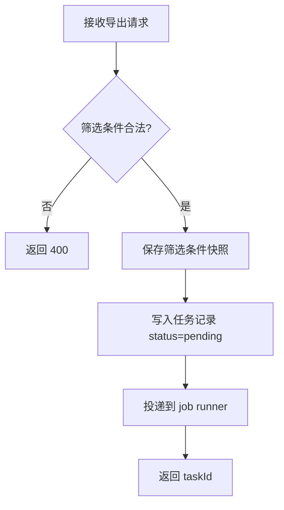
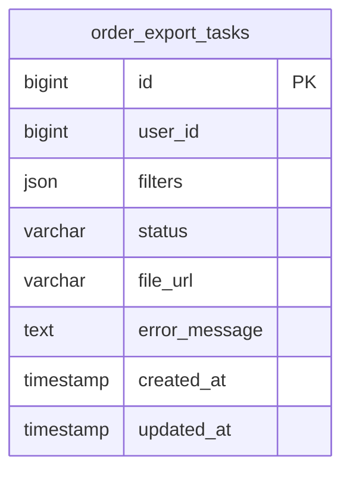

# 模块：task

> 设计时间: 2026-05-08
>
> 实施时间: —
>
> 所属设计: [订单批量导出](../index.md)
>
> 模块状态: ⏳ 待实现

## 1. 模块概述

**模块职责**: 提供导出任务的创建和查询接口，定义数据结构与表设计。

**业务边界**:

- 负责: 任务创建/查询 API、任务表与迁移、参数校验
- 不负责: CSV 文件生成（由 csv 模块负责）

### 1.1 依赖说明

无模块间依赖（本模块为被依赖方）。

### 1.2 被依赖说明

| 被依赖模块             | 本模块提供的内容          | 本模块对应章节             |
| ---------------------- | ------------------------- | -------------------------- |
| [csv](../csv/index.md) | `ExportTask` 类型、任务表 | §4 数据结构、§5 数据库设计 |

## 2. 核心流程



## 3. API 定义

### 3.1 HTTP 接口

#### `POST /api/orders/export-tasks`

**描述**: 根据筛选条件创建导出任务。

**请求参数**:

| 参数    | 位置 | 类型   | 必填 | 说明             |
| ------- | ---- | ------ | ---- | ---------------- |
| filters | body | object | 是   | 当前订单筛选条件 |

**返回**:

| 字段   | 类型   | 说明             |
| ------ | ------ | ---------------- |
| taskId | string | 导出任务 ID      |
| status | string | 固定为 `pending` |

**错误码**: 400 参数错误 / 500 内部错误

#### `GET /api/orders/export-tasks/:taskId`

**描述**: 查询单个导出任务状态与结果。

**返回**:

| 字段         | 类型   | 说明                                         |
| ------------ | ------ | -------------------------------------------- |
| taskId       | string | 任务 ID                                      |
| status       | string | `pending` / `running` / `success` / `failed` |
| fileUrl      | string | 成功时返回下载地址                           |
| errorMessage | string | 失败时返回错误信息                           |

**错误码**: 404 任务不存在 / 500 内部错误

### 3.2 函数/方法接口

#### `createExportTask(userId: string, filters: OrderFilters): Promise<ExportTask>`

| 参数    | 类型         | 必填 | 说明     |
| ------- | ------------ | ---- | -------- |
| userId  | string       | 是   | 发起人   |
| filters | OrderFilters | 是   | 筛选条件 |

**返回**: `Promise<ExportTask>` — 新建的导出任务

#### `getExportTask(taskId: string): Promise<ExportTask>`

| 参数   | 类型   | 必填 | 说明    |
| ------ | ------ | ---- | ------- |
| taskId | string | 是   | 任务 ID |

**返回**: `Promise<ExportTask>` — 任务记录

## 4. 数据结构

### OrderFilters

本示例的订单筛选契约在本模块唯一维护，csv 模块直接引用。空对象表示不增加筛选条件；不接受未知字段，已提供字段不得为 null。

```typescript
interface OrderFilters {
  keyword?: string
  status?: 'pending' | 'paid' | 'cancelled'
}
```

`keyword` 为 1–100 个字符，匹配订单编号或标题；省略表示不按关键词筛选。`status` 使用订单状态，与导出任务的处理状态不同。时间范围筛选尚未纳入该契约，是否增加由 §11 的未决问题确认后更新。

### ExportTask

```typescript
interface ExportTask {
  taskId: string
  userId: string
  filters: OrderFilters
  status: 'pending' | 'running' | 'success' | 'failed'
  fileUrl?: string
  errorMessage?: string
  createdAt: string
  updatedAt: string
}
```

repository 将数据库 BIGINT 标识转为十进制字符串，避免 JavaScript number 精度损失；时间字段转为 ISO 8601 字符串。

## 5. 数据库设计

### ER 图



本次只新增导出任务表，不改变现有用户或订单表；`user_id` 记录发起人标识，不在本次迁移中新增跨表外键。

### 表结构定义

#### `order_export_tasks`

| 字段          | 类型          | 约束                        | 说明         |
| ------------- | ------------- | --------------------------- | ------------ |
| id            | BIGINT        | PK, AUTO_INCREMENT          | 主键         |
| user_id       | BIGINT        | NOT NULL                    | 发起用户     |
| filters       | JSON          | NOT NULL                    | 筛选条件快照 |
| status        | VARCHAR(20)   | NOT NULL, DEFAULT 'pending' | 任务状态     |
| file_url      | VARCHAR(1024) | NULL                        | 导出文件地址 |
| error_message | TEXT          | NULL                        | 失败原因     |
| created_at    | TIMESTAMP     | NOT NULL                    | 创建时间     |
| updated_at    | TIMESTAMP     | NOT NULL                    | 更新时间     |

### 索引设计

| 表                 | 索引名              | 字段                | 类型  | 用途              |
| ------------------ | ------------------- | ------------------- | ----- | ----------------- |
| order_export_tasks | idx_user_created_at | user_id, created_at | BTREE | 用户最近任务查询  |
| order_export_tasks | idx_status          | status              | BTREE | worker 扫描待处理 |

### 迁移说明

- 新增表: `order_export_tasks`
- 变更表: 无
- 数据迁移: 无历史数据

## 7. 影响面与兼容性

- **本模块影响**: `server/modules/order/` 新增导出相关文件
- **对依赖模块的影响**: 为 csv 模块提供数据结构和表访问
- **兼容性处理**: 原有订单列表接口不变
- **迁移/发布注意事项**: 先发布表结构与 API，再部署 csv 模块

## 8. 单元测试设计

### 8.1 测试策略

- **测试框架**: Vitest
- **工作目录**: 消费项目根目录
- **模块运行命令**: `npx --no-install vitest run server/modules/order`
- **项目完整单元测试命令**: `npx --no-install vitest run --exclude '**/*.integration.test.ts'`
- **Mock 策略**: mock repository、job runner
- **依赖模块 mock**: 无

### 8.2 测试用例

#### `createExportTask` 测试

| 用例编号      | 用例                | 输入              | 预期输出            | 类型       | 状态      |
| ------------- | ------------------- | ----------------- | ------------------- | ---------- | --------- |
| `task-UT-001` | 正常路径 - 创建成功 | `filters={status: 'paid'}` | 返回 `pending` 任务 | happy path | ⏳ 待实现 |
| `task-UT-002` | 边界 - 空筛选条件   | `{}`              | 导出全部数据        | boundary   | ⏳ 待实现 |
| `task-UT-003` | 异常 - 无效 filters | `{invalid: true}` | 抛出参数错误        | error      | ⏳ 待实现 |

#### `getExportTask` 测试

| 用例编号      | 用例                | 输入              | 预期输出       | 类型       | 状态      |
| ------------- | ------------------- | ----------------- | -------------- | ---------- | --------- |
| `task-UT-004` | 正常路径 - 查询成功 | 存在的 `taskId`   | 返回任务记录   | happy path | ⏳ 待实现 |
| `task-UT-005` | 异常 - 任务不存在   | 不存在的 `taskId` | 抛出 not found | error      | ⏳ 待实现 |

#### repository 与 controller 测试

| 用例编号 | 用例 | 输入 | 预期输出 | 类型 | 状态 |
| --- | --- | --- | --- | --- | --- |
| `task-UT-006` | repository 保存并查询 | mock 数据库返回 id=1 的 pending 记录 | 保存参数含 filters，查询返回对应 ExportTask | happy path | ⏳ 待实现 |
| `task-UT-007` | repository 查询不存在记录 | mock 数据库返回空结果 | 返回空结果，由 service 转换为 not found | boundary | ⏳ 待实现 |
| `task-UT-008` | repository 数据库失败 | mock 数据库抛出连接错误 | 向调用方传播错误，不返回成功任务 | error | ⏳ 待实现 |
| `task-UT-009` | controller 创建成功 | `filters={status: 'paid'}`，mock service 返回 taskId='1' | 响应包含 taskId='1'、status=pending | happy path | ⏳ 待实现 |
| `task-UT-010` | controller 非法参数 | filters 缺失或类型错误 | 返回 400，不调用 service | error | ⏳ 待实现 |
| `task-UT-011` | controller 查询不存在任务 | mock service 抛出 not found | 返回 404 | error | ⏳ 待实现 |

### 8.3 测试文件规划

| 测试文件                                               | 覆盖目标          |
| ------------------------------------------------------ | ----------------- |
| `server/modules/order/order-export.service.test.ts`    | 任务创建/查询逻辑 |
| `server/modules/order/order-export.controller.test.ts` | 请求校验与响应    |
| `server/modules/order/order-export.repository.test.ts` | 数据库调用与记录映射 |

> 项目级单元测试报告固定写入 `tests/test-report.md`，不为本模块创建独立报告。

> 与 csv 的跨模块协作验证由调用方 [csv §8.4](../csv/index.md#84-项目内集成验证) 定义，本模块不重复定义同一集成用例。

## 9. 实施计划

| 步骤 | 可测试单元 | 涉及文件 | 对应设计 | 用例编号 | 依赖 | 状态 |
| --- | --- | --- | --- | --- | --- | --- |
| 1 | 定义类型、迁移与 repository，立即测试记录映射、空结果和数据库错误；迁移另在测试库验证 | `server/db/migrations/*`、`server/modules/order/order-export.repository.ts` 及对应测试 | §4、§5、§8 | `task-UT-006` 至 `008` | — | ⏳ 待实现 |
| 2 | 实现 service，立即编写并运行创建、查询测试 | `server/modules/order/order-export.service.ts` 及对应测试 | §3、§8 | `task-UT-001` 至 `005` | 步骤 1 | ⏳ 待实现 |
| 3 | 实现 controller，立即编写并运行请求及响应测试 | `server/modules/order/order-export.controller.ts` 及对应测试 | §3、§8 | `task-UT-009` 至 `011` | 步骤 2 | ⏳ 待实现 |
| 4 | 运行全量回归并按验收标准核验 | §8.3 全部测试文件 | §8、§10 | `task-UT-001` 至 `011` | 步骤 3 | ⏳ 待实现 |

## 10. 验收标准

| # | 对应需求 | 设计位置 | 验收项 | 用例编号或核验方法 | 状态 |
| --- | --- | --- | --- | --- | --- |
| 1 | 创建导出任务、保存筛选快照 | §3.1 创建接口、§4、§5 | 返回 pending 任务，正确持久化快照 | `task-UT-001`、`002`、`006`、`008`、`009` | ⏳ 待实现 |
| 2 | 查询任务状态与结果 | §3.1 查询接口、§3.2 | 返回对应任务，不存在时返回 404 | `task-UT-004`、`005`、`007`、`011` | ⏳ 待实现 |
| 3 | 筛选条件校验 | §3、§4 OrderFilters | 非法参数返回 400，不创建任务 | `task-UT-003`、`010` | ⏳ 待实现 |
| 4 | 本模块测试要求 | §8 | 本模块全部单元用例通过 | `task-UT-001` 至 `011`，执行 §8.1 命令 | ⏳ 待实现 |

## 11. 未决问题

| #   | 问题                             | 影响范围     | 需要谁确认 |
| --- | -------------------------------- | ------------ | ---------- |
| 1   | 筛选条件快照的 JSON 字段容量上限 | 表结构设计   | 后端负责人 |
| 2   | 是否需要支持按时间范围批量导出   | API 参数设计 | 产品       |

上述事项尚待确认；在其影响范围内不得绕过设计确认直接实施。确认后原位更新 §3/§4/§5 及关联测试，不追加方案历史。
