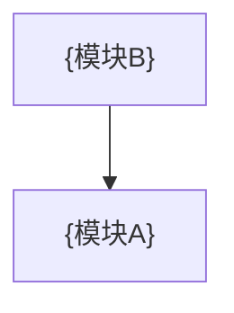

# {设计标题} — 总设计文档

> 设计时间: {YYYY-MM-DD}
>
> 需求来源: {用户需求原文摘要}

## 1. 背景与目标

**需求背景**: {为什么要做}

**预期结果**: {做完之后系统会变成什么样}

## 2. 范围 / 非范围

**In Scope**:

- {要做的事项}

**Out of Scope**:

- {明确不做的事项}

## 3. 代码规范

各模块实施时遵循:

- 命名规范: {文件/变量/函数/类的命名约定}
- 代码风格: {缩进、引号、分号等}
- 错误处理: {异常处理模式，如 try-catch 或错误中间件}
- 日志规范: {日志库、日志级别、关键路径日志格式}
- 注释规范: {JSDoc/Docstring 等标准}

## 4. 视觉规范（按需出现）

> 仅在需求涉及用户交互时输出；否则整段省略。
>
> 状态: ⏳ 待实现
>
> 以下为模板，designer 落地时填入实际值。

### 色值表

| 色名         | 色值      |
| ------------ | --------- |
| `{blue-500}` | `#1a73e8` |
| `{blue-300}` | `#8ab4f8` |
| `{red-500}`  | `#ea4335` |
| `{gray-100}` | `#f8f9fa` |
| `{gray-900}` | `#202124` |

> 命名约定: `{色相}-{深度}`。代码中禁止直接使用色值，一律引用色名常量。

### 语义映射

| 用途       | 亮色           | 暗色           |
| ---------- | -------------- | -------------- |
| {页面背景} | `{gray-100}`   | `{gray-900}`   |
| {主文字}   | `{gray-900}`   | `{gray-100}`   |
| {次要文字} | `{gray-500}`   | `{gray-400}`   |
| {主色}     | `{blue-500}`   | `{blue-300}`   |
| {辅色}     | `{green-500}`  | `{green-300}`  |
| {边框}     | `{gray-300}`   | `{gray-600}`   |
| {禁用}     | `{gray-300}`   | `{gray-600}`   |
| {成功}     | `{green-500}`  | `{green-300}`  |
| {警告}     | `{orange-500}` | `{orange-300}` |
| {错误}     | `{red-500}`    | `{red-300}`    |

### 字体

| 用途 | 字号   | 单位        | 字重     |
| ---- | ------ | ----------- | -------- |
| 标题 | {size} | {px/pt/rem} | {weight} |
| 正文 | {size} | {px/pt/rem} | {weight} |

### 间距

| 档位 | 值      | 单位       |
| ---- | ------- | ---------- |
| xs   | {value} | {px/pt/dp} |
| sm   | {value} | {px/pt/dp} |
| md   | {value} | {px/pt/dp} |
| lg   | {value} | {px/pt/dp} |

### 圆角

| 档位 | 值      | 单位       |
| ---- | ------- | ---------- |
| sm   | {value} | {px/pt/dp} |
| md   | {value} | {px/pt/dp} |
| lg   | {value} | {px/pt/dp} |

### 阴影

| 档位 | X偏移   | Y偏移   | 模糊    | 颜色         |
| ---- | ------- | ------- | ------- | ------------ |
| sm   | {value} | {value} | {value} | `{gray-500}` |
| md   | {value} | {value} | {value} | `{gray-500}` |
| lg   | {value} | {value} | {value} | `{gray-500}` |

> 偏移和模糊单位: {px/pt/dp}

## 5. 模块索引与依赖关系

### 4.1 模块划分

| 模块    | 职责   | 文档                      | 依赖模块 | 状态      |
| ------- | ------ | ------------------------- | -------- | --------- |
| {模块A} | {职责} | [{模块A}](./{a}/index.md) | —        | ⏳ 待实现 |
| {模块B} | {职责} | [{模块B}](./{b}/index.md) | {模块A}  | ⏳ 待实现 |

### 4.2 模块依赖图

> 箭头方向：依赖方 → 被依赖方（如 B 依赖 A，则 B → A）

### 4.3 循环依赖检查

> 结果: ✅ 无循环依赖 | ❌ 检测到循环依赖（{列出涉及的模块}）

- 已对依赖图执行 DFS 环检测
- 若存在环：列出环中模块，建议合并或打破某条依赖后重新设计

## 6. 风险与回滚

| 风险       | 概率     | 影响       | 缓解措施   |
| ---------- | -------- | ---------- | ---------- |
| {风险描述} | 高/中/低 | {影响范围} | {怎么缓解} |

**回滚方式**: {如何回滚到变更前状态}

## 7. 跨模块未决问题

| #   | 问题           | 影响范围       | 需要谁确认 |
| --- | -------------- | -------------- | ---------- |
| 1   | {待确认的问题} | {影响什么决策} | {角色/人}  |

> 仅列出跨模块问题，模块内部问题放入对应模块文档 §11。
