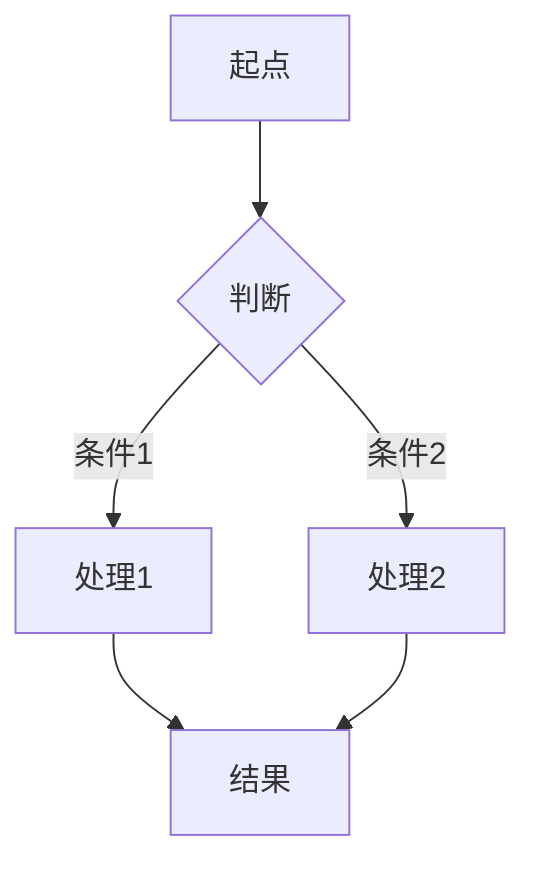
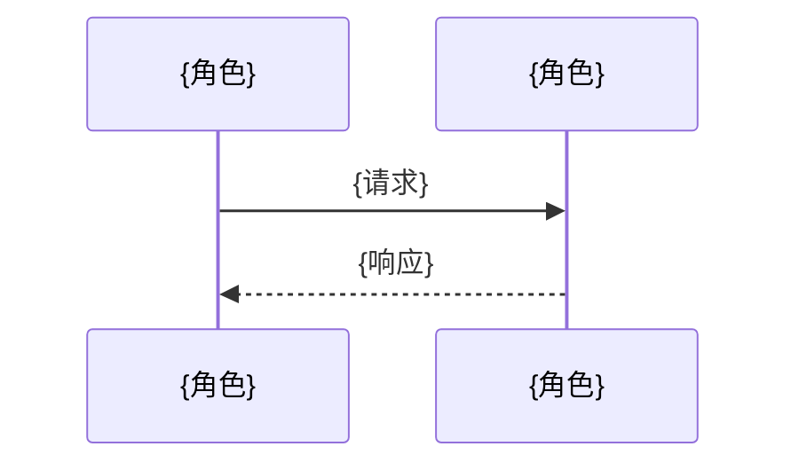
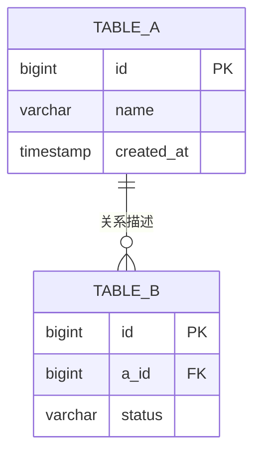

# 模块：{模块名称}

> 设计时间: {YYYY-MM-DD}
>
> 实施时间: —
>
> 所属设计: [{设计标题}](../index.md)
>
> 模块状态: ⏳ 待实现

## 1. 模块概述

**模块职责**: {这句话清晰说明该模块负责什么业务能力}

**业务边界**:

- 负责: {列表}
- 不负责: {列表}

### 1.1 依赖说明

| 依赖模块                   | 依赖内容        | 引用章节    |
| -------------------------- | --------------- | ----------- |
| [{模块A}](../{a}/index.md) | `{接口/类型名}` | §3 API 定义 |

> 实施时请确保依赖模块的 API 已实现或已 mock。

（无模块间依赖则写"无"）

### 1.2 被依赖说明

| 被依赖模块                 | 本模块提供的内容 | 本模块对应章节 |
| -------------------------- | ---------------- | -------------- |
| [{模块C}](../{c}/index.md) | `{接口/类型名}`  | §3 API 定义    |

（无则写"无"）

### 1.3 外部依赖

#### {服务A}

| 依赖模块 | 依赖 API                                                                   | 不可用时策略     |
| -------- | -------------------------------------------------------------------------- | ---------------- |
| {charge} | [POST /v1/charges](../external-service/{a}/charge.md#post-v1-charges)      | {兜底/降级/mock} |
| {charge} | [GET /v1/charges/:id](../external-service/{a}/charge.md#get-v1-charges-id) | {兜底/降级/mock} |

#### {服务B}

| 依赖模块 | 依赖 API                                                      | 不可用时策略     |
| -------- | ------------------------------------------------------------- | ---------------- |
| {push}   | [POST /v1/push](../external-service/{b}/push.md#post-v1-push) | {兜底/降级/mock} |

> 外部服务放 `design-doc/external-service/{name}/`：`index.md` 服务总览 + `{module}.md` API 模块，锚点为 `{method}-{path}`。

（无外部服务依赖则写"无"）

## 2. 核心流程



> 复杂场景补充时序图:



## 3. API 定义

### 3.1 HTTP 接口

#### `METHOD /api/path`

**描述**: {一句话}

**请求参数**:

| 参数   | 位置            | 类型   | 必填  | 说明   |
| ------ | --------------- | ------ | ----- | ------ |
| {name} | path/query/body | {type} | 是/否 | {说明} |

**返回**:

| 字段   | 类型   | 说明   |
| ------ | ------ | ------ |
| {name} | {type} | {说明} |

**错误码**: {列出主要错误码及含义}

### 3.2 函数/方法接口

#### `functionName(param: Type): ReturnType`

| 参数   | 类型   | 必填  | 说明   |
| ------ | ------ | ----- | ------ |
| {name} | {type} | 是/否 | {说明} |

**返回**: `{ReturnType}` — {说明}

## 4. 数据结构

```typescript
// 本模块涉及的类型定义
interface {EntityName} {
  id: string
  {field}: {Type}
}
```

跨模块共享类型在定义方模块文档中查找，其他模块通过依赖引用获取。

## 5. 数据库设计（按需出现）

> 仅在需求涉及数据库、存储结构、表结构变更、索引、迁移时输出；否则整段省略。

### ER 关系图



### 表结构定义

#### `table_name`

| 字段       | 类型      | 约束                      | 说明     |
| ---------- | --------- | ------------------------- | -------- |
| id         | BIGINT    | PK, AUTO_INCREMENT        | 主键     |
| {field}    | {type}    | {constraint}              | {说明}   |
| created_at | TIMESTAMP | DEFAULT CURRENT_TIMESTAMP | 创建时间 |

### 索引设计

| 表         | 索引名      | 字段    | 类型  | 用途       |
| ---------- | ----------- | ------- | ----- | ---------- |
| table_name | idx\_{name} | {field} | BTREE | {查询场景} |

### 迁移说明

- 新增表: {列出}
- 变更表: {列出}
- 数据迁移: {策略}

## 6. 用户交互设计（按需出现）

> 仅在需求涉及用户交互（页面、交互、组件）时输出；否则整段省略。

### 组件拆分

| 层级     | 组件名             | 职责   | 复用来源             | 备注   |
| -------- | ------------------ | ------ | -------------------- | ------ |
| 页面     | {PageComponent}    | {职责} | 自定义页面容器       | {备注} |
| 区域     | {SectionComponent} | {职责} | 项目内已有/开源/自研 | {备注} |
| 基础组件 | {BaseComponent}    | {职责} | 项目内已有/开源/自研 | {备注} |

### 组件复用优先级检查

1. 项目内已有组件与组件工具集
2. 开源组件搜索结果
3. 自研实现（仅在前两者都不满足时）

### 界面结构说明

- 页面结构: {页面如何分区}
- 组件组合关系: {组件之间如何嵌套与通信}
- 状态归属: {哪些状态在页面层，哪些状态在组件层}

## 7. 影响面与兼容性

- **本模块影响**: {影响哪些文件/路径}
- **对依赖模块的影响**: {是否需要依赖模块配合变更}
- **兼容性处理**: {向后兼容策略}
- **迁移/发布注意事项**: {数据迁移、灰度等}

## 8. 单元测试设计

### 8.1 测试策略

- **测试框架**: {项目使用的测试框架}
- **Mock 策略**: {哪些依赖需要 mock，哪些走真实调用}
- **依赖模块 mock**: {需要 mock 的外部模块接口}

### 8.2 测试用例

#### {函数/组件名} 测试

| 用例              | 输入       | 预期输出        | 类型       | 状态      |
| ----------------- | ---------- | --------------- | ---------- | --------- |
| 正常路径 - {场景} | {输入描述} | {预期结果}      | happy path | ⏳ 待实现 |
| 边界 - {场景}     | {输入描述} | {预期结果}      | boundary   | ⏳ 待实现 |
| 异常 - {场景}     | {输入描述} | {预期错误/行为} | error      | ⏳ 待实现 |

### 8.3 测试文件规划

| 测试文件               | 覆盖目标     |
| ---------------------- | ------------ |
| `tests/{name}.test.ts` | {对应源文件} |

## 9. 实施计划

| 步骤 | 内容           | 涉及文件               | 对应设计 | 依赖   | 状态      |
| ---- | -------------- | ---------------------- | -------- | ------ | --------- |
| 1    | {动作}         | `{path}`               | §3       | —      | ⏳ 待实现 |
| 2    | {动作}         | `{path}`               | §4       | 步骤 1 | ⏳ 待实现 |
| 3    | 编写单元测试   | `tests/{name}.test.ts` | §8       | 步骤 2 | ⏳ 待实现 |
| 4    | 运行测试并验证 | —                      | §10      | 步骤 3 | ⏳ 待实现 |

> 每步标注对应的设计章节（§3 API / §4 数据 / §5 DB / §6 组件 / §8 测试 / §10 验收），确保实施计划完整覆盖所有设计需求。
> 若某步骤依赖其他模块接口，在依赖列标注"依赖 {模块A} 步骤 N"

## 10. 验收标准

| #   | 验收项           | 验证方式     | 状态      |
| --- | ---------------- | ------------ | --------- |
| 1   | {功能验收条件}   | {怎么验证}   | ⏳ 待实现 |
| 2   | {边界场景}       | {怎么验证}   | ⏳ 待实现 |
| 3   | 单元测试全部通过 | 运行测试命令 | ⏳ 待实现 |

## 11. 未决问题

| #   | 问题           | 影响范围   | 需要谁确认 |
| --- | -------------- | ---------- | ---------- |
| 1   | {待确认的问题} | {影响范围} | {角色/人}  |

> 仅列出本模块内部未决问题，跨模块问题放入总文档 §7。
