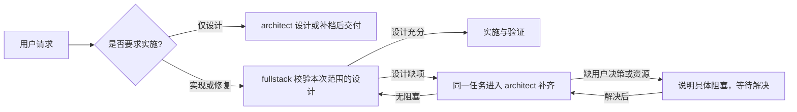

# fullstack

`/engineer:fullstack` 是一个按设计文档落地实现代码的 skill。

它的目标是把设计文档精确转化为可编译/可运行的实现代码，覆盖异常处理、关键路径日志、单元测试和测试报告。它不替代架构师做设计，但可在落地过程中对设计做合理性校验。

## 什么时候用

适合这些场景：

- 已有一份设计文档（`/designer:architect` 输出或手写），需要按文档写代码
- 跨模块改造经过设计阶段，需严格按方案执行
- 希望确保实现与设计文档的 API、数据结构、测试用例一致
- 直接提出实现或小修复需求，尚无设计时先在同一任务进入 architect 补齐

不适合这些场景：

- 纯讨论，没有代码上下文
- 用户只需要伪代码或思路
- 用户仅要求设计或补档，未要求实施

## 这个 skill 会做什么

触发后，它会按固定顺序工作：

1. 查找并校验设计是否足以支持本次范围；缺失时先进入 architect 补齐后返回
2. 根据宿主可用 skill、已有发现结果及任务线索，读取相关库 skill 与 API 文档，核对复用方案
3. 设计缺项交由 architect 补全文档并重新校验，实际执行问题按环境和权限处理
4. 按本次范围及必要依赖子图的拓扑序逐单元实施，优先复用现有接口，只实现已确认的能力缺口
5. 即时写测试并运行，更新模块文档实施时间和状态
6. 产出测试报告
7. 为可复用库/工具维护随库携带的轻量 skill；需要注册时告知用户手动执行独立 skill
8. 自检后交付（含跨模块集成点检查）

## 这个 skill 不会做什么

- 不无设计文档直接编码
- 不跳过测试或推迟到最后统一补
- 不擅自修改设计文档以外的模块
- 不写伪代码或留 TODO 占位
- 不自动 commit / push / 创建 PR
- 不超出用户授权范围修改既有代码

## 与 designer:architect 的协同



同一任务按设计是否充分切换阶段，不要求用户在两个 skill 之间重复提需求。设计交接说明文档路径、scope 和阻塞情况；fullstack 校验本次范围及必要依赖后再编码，不能仅凭文档已生成或某模块状态显示完成就开始实施。

## 使用示例

### 示例 1：单模块后端实现

```text
/engineer:fullstack 按这份设计文档实现用户昵称更新能力
```

预期执行顺序：

- 校验设计和测试用例 → 有设计缺项时由 architect 补全文档并重新校验 → 按 repository、service、controller 的依赖顺序逐单元实现、测试并运行 → 项目回归 → 产出测试报告

### 示例 2：前后端联动需求

```text
/engineer:fullstack 执行这份订单批量导出设计文档
```

预期执行顺序：

- 校验设计和测试用例 → 确认依赖顺序 → 逐单元实现后端及前端，每单元立即测试并运行 → 按设计验证集成点 → 项目回归和测试报告

## 强约束

### 设计文档是强制前置条件

没有设计文档不得编码。业务规则、接口、边界处理、环境兼容约束及具体测试用例须在设计中明确；缺项或冲突交由 `/designer:architect` 补全文档，fullstack 重新校验后再实施。聊天答案不能代替文档更新。本地工具、依赖安装、权限等执行问题由 fullstack 在授权范围内检查处理；若需要改变设计，则返回 architect。

### 既有代码修改遵循授权范围

说明改动原因、影响范围和具体风险。用户已授权的实现或修复包含范围内的正常改动；只有范围扩展或未授权操作才另行确认。

### 实施前发现并复用已有能力

根据宿主可用 skill、用户已有的发现结果、依赖和调用代码定位相关能力，读取 skill 及 API 文档后判断复用范围。没有 skill 时仍检查库文档、接口和已有调用。项目级扫描与注册由用户主动执行独立的 [discover-skills](../discover-skills/SKILL.md)，fullstack 不在每次编码前重复执行。

### 库 skill 是轻量发现入口

可复用库或工具必须提供描述能力、使用场景、代码入口和 API 文档位置的 skill；不要求普通库具备复杂工作流，不重复抄写整份 API 文档。

唯一维护源与库一起保存、迁移和分发，默认放在 `<库根目录>/skills/<skill-name>/SKILL.md`。用户按需执行 `/engineer:discover-skills` 注册项目发现入口；当前任务可直接读取源文件，不受尚未注册影响。fullstack 不创建或修复软链接。具体规则见 [编写指南](references/skill-writing-guide.md)。

### 设计文档保持当前方案

实现和修复都不把设计文档当成记录。恢复既有设计的修复不改设计正文；确需变更方案时，由 architect 原位更新当前要求。状态只更新当前值，修复说明在聊天中交付，历史由 Git 保存，测试证据进入测试报告。

### 测试与实现成对交付

每完成一个独立单元就立即写测试并运行，测试通过才进入下一单元。

不得仅为让测试通过而删除失败用例、弱化断言、修改预期、缩小执行范围或跳过测试，也不能 mock 掉被测逻辑来制造通过。合法测试调整须有需求、设计或测试错误依据；预期行为变化先更新设计。无法执行的测试如实报告，不计作通过。

项目内集成验证只执行设计 §8.4 明确的 IT 用例，不在实施验收时临时扩大要求。集成结果在同一报告附节独立记录，不混入单元测试统计；本次实施完成仍须满足对应集成验收。

单元与集成优先分别执行。混跑时按结构化结果归因，不能因 IT 失败造成的非零退出码而误判单元失败；无法可靠拆分时，单元结论为 INCOMPLETE。依赖判断也须核对模块头部、条目状态及实际接口，不能只看已完成标记。

### 测试报告统一汇总

正常交付前运行项目完整单元测试集，按统一模板整体生成唯一报告 `tests/test-report.md`。失败或中断时也记录本轮结果、实际范围和未运行用例；跳过或零用例不能判为 PASS。报告按业务模块汇总，本地外部 API 调用代码通过 mock 测试并归属调用方模块，不单列外部服务测试模块。JUnit、JSON、coverage 等输出作为数据来源。

本次实施范围与项目测试报告分别判断：只实施一个模块时，不要求补做范围外模块；范围外未实现项仍如实反映在项目报告中。模块状态仅在模块文档维护，不在总文档复制。

## 目录结构

```text
skills/fullstack/
├── SKILL.md
├── README.md
├── assets/
│   └── test-report-template.md
└── references/
    ├── checklist.md
    └── skill-writing-guide.md
```

## 文件说明

- `SKILL.md`
  - 供支持 Agent Skills 的宿主读取的执行规约
- `references/checklist.md`
  - 交付前自检清单
- `assets/test-report-template.md`
  - `tests/test-report.md` 的统一项目级报告模板
- `references/skill-writing-guide.md`
  - 轻量库 skill 编写指南，包含能力发现、API 文档引用、随库迁移、宿主入口和验证规则

## 产出质量判断标准

一个合格的输出，至少要满足：

- 本次实施范围内设计要求都有对应落地
- 已核对并优先复用相关现有能力，新增实现的缺口有依据
- 代码可编译/可运行
- API 签名与文档一致
- 数据结构字段与文档一致
- 每单元都有测试且已通过
- 测试报告已产出
- 本次可复用库/工具的随库 skill 与 API 文档已同步，需要用户执行的注册事项已说明
- 未决问题与文档偏差已回报
